## Descripción

## Resolucion de la maquina

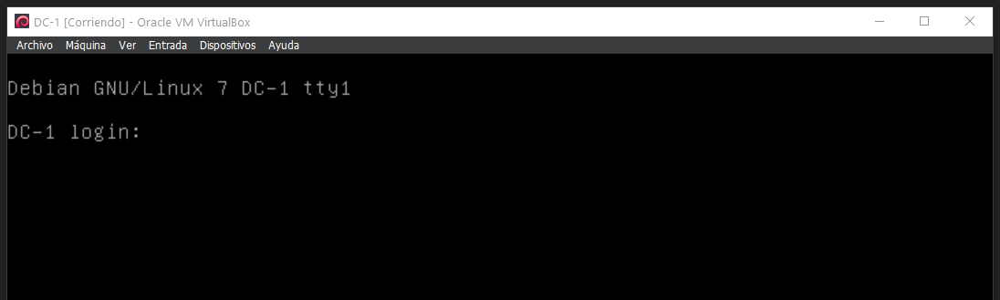

### Fase de Fingerprinting / Reconocimiento (Reconnaissance):

#### Descubrimiento de IP objetivo en la red

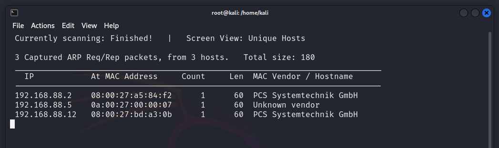

#### Descubrimiento de puertos y servicios en el host objetivo

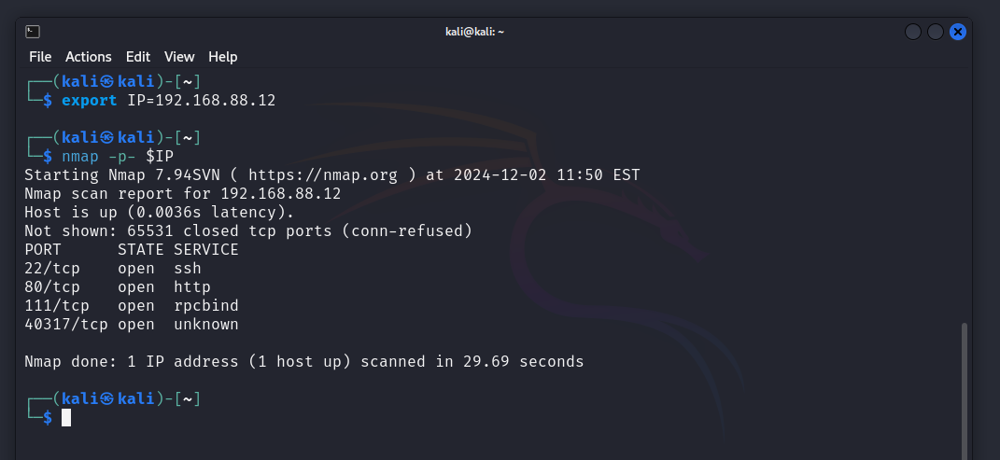

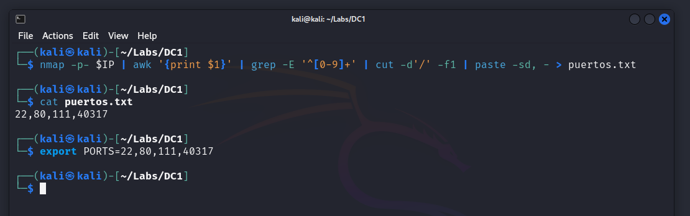

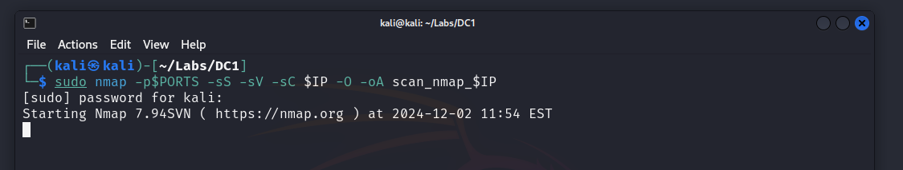

```txt
PORT      STATE SERVICE VERSION
22/tcp    open  ssh     OpenSSH 6.0p1 Debian 4+deb7u7 (protocol 2.0)
| ssh-hostkey: 
|   1024 c4:d6:59:e6:77:4c:22:7a:96:16:60:67:8b:42:48:8f (DSA)
|   2048 11:82:fe:53:4e:dc:5b:32:7f:44:64:82:75:7d:d0:a0 (RSA)
|_  256 3d:aa:98:5c:87:af:ea:84:b8:23:68:8d:b9:05:5f:d8 (ECDSA)
```

```txt
PORT      STATE SERVICE VERSION
80/tcp    open  http    Apache httpd 2.2.22 ((Debian))
|_http-server-header: Apache/2.2.22 (Debian)
|_http-generator: Drupal 7 (http://drupal.org)
|_http-title: Welcome to Drupal Site | Drupal Site
| http-robots.txt: 36 disallowed entries (15 shown)
| /includes/ /misc/ /modules/ /profiles/ /scripts/ 
| /themes/ /CHANGELOG.txt /cron.php /INSTALL.mysql.txt 
| /INSTALL.pgsql.txt /INSTALL.sqlite.txt /install.php /INSTALL.txt 
|_/LICENSE.txt /MAINTAINERS.txt
```

```txt
PORT      STATE SERVICE VERSION
111/tcp   open  rpcbind 2-4 (RPC #100000)
| rpcinfo: 
|   program version    port/proto  service
|   100000  2,3,4        111/tcp   rpcbind
|   100000  2,3,4        111/udp   rpcbind
|   100000  3,4          111/tcp6  rpcbind
|   100000  3,4          111/udp6  rpcbind
|   100024  1          39333/tcp6  status
|   100024  1          40317/tcp   status
|   100024  1          57775/udp6  status
|_  100024  1          58983/udp   status
```


### Fase de Footprinting / Exploración (Scanning):

#### Exploracion puerto 22

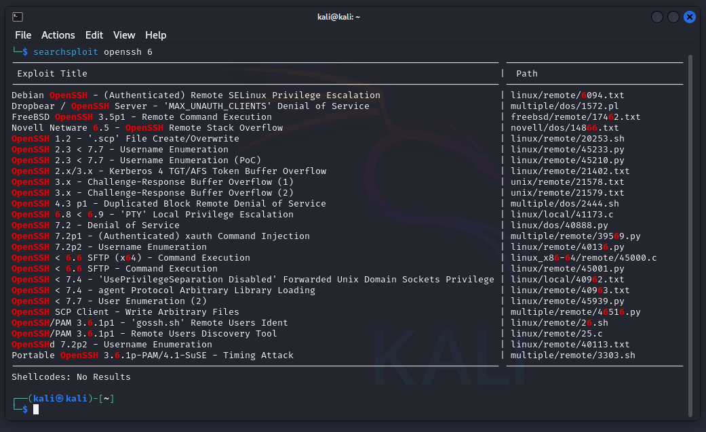


#### Exploracion puerto 80

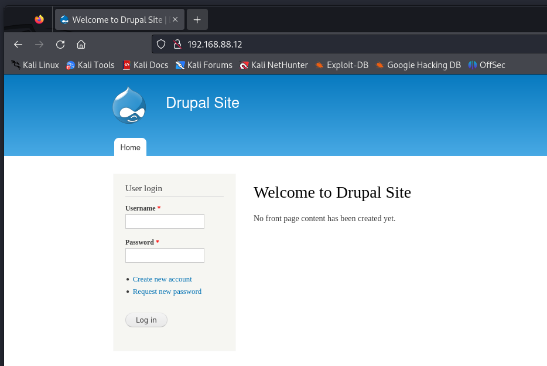

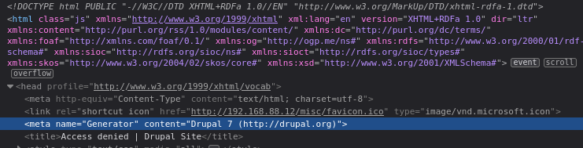

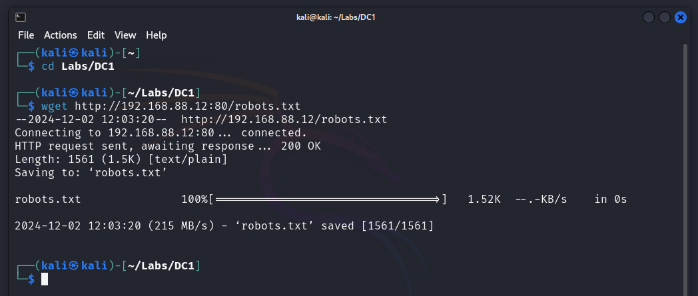

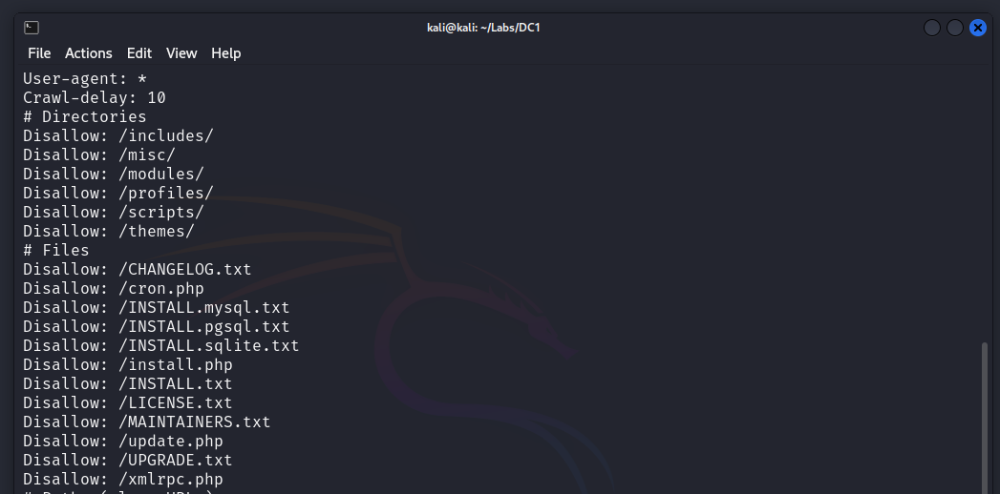


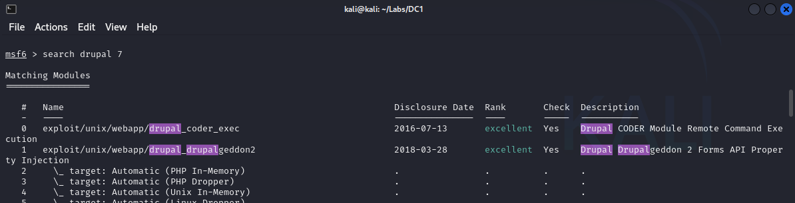

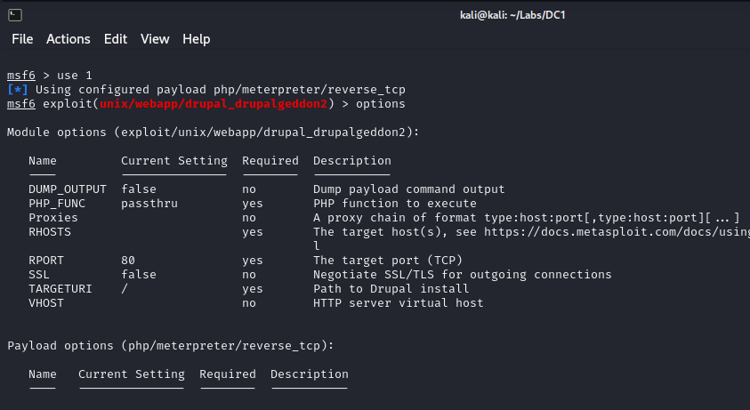

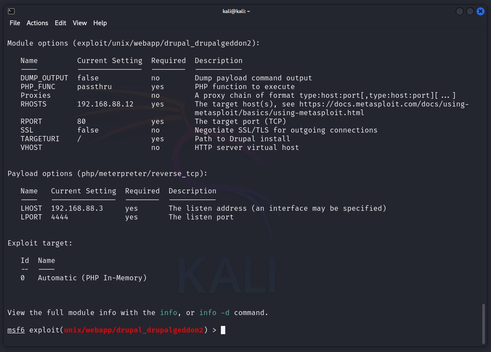

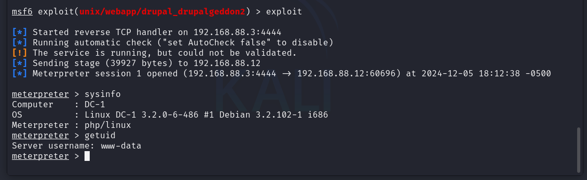

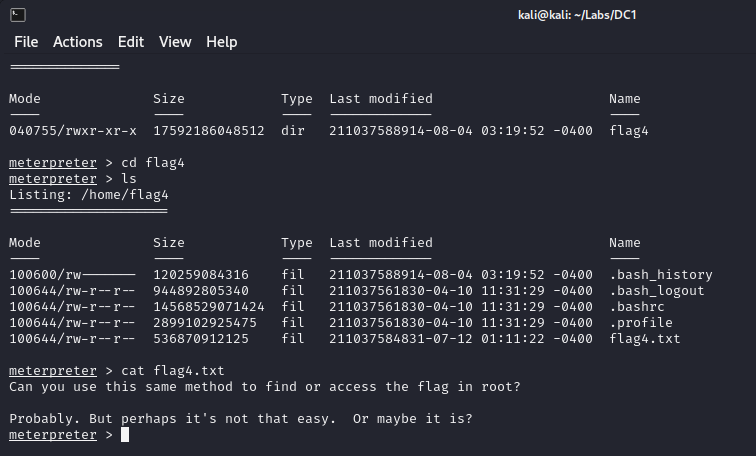

pwd
ls -l
cat flag1.txt

Some settings are setup in settings.php (the default location is sites/default.) This contains global config options (like database username/password)

Entramos en una shell de la maquina desde meterpreter y mediante pyhton importamos /bin/bash para tener un entorno mas amigable.

shell
python -c 'import pty; pty.spawn("/bin/bash")'

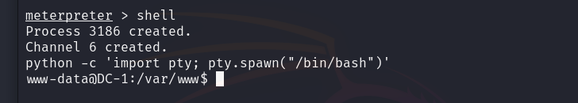

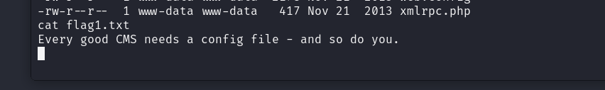

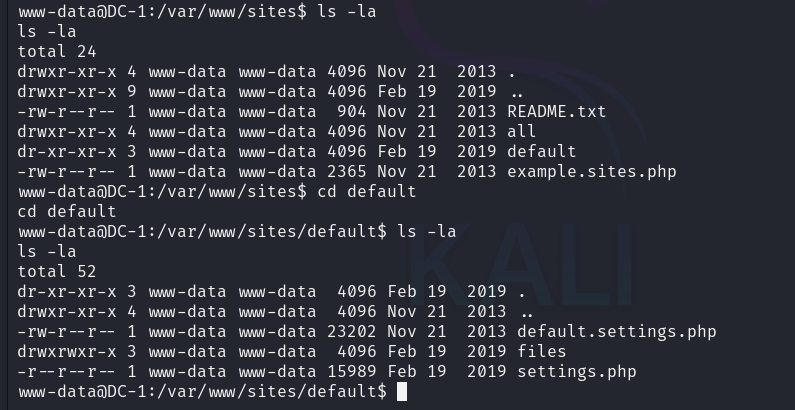

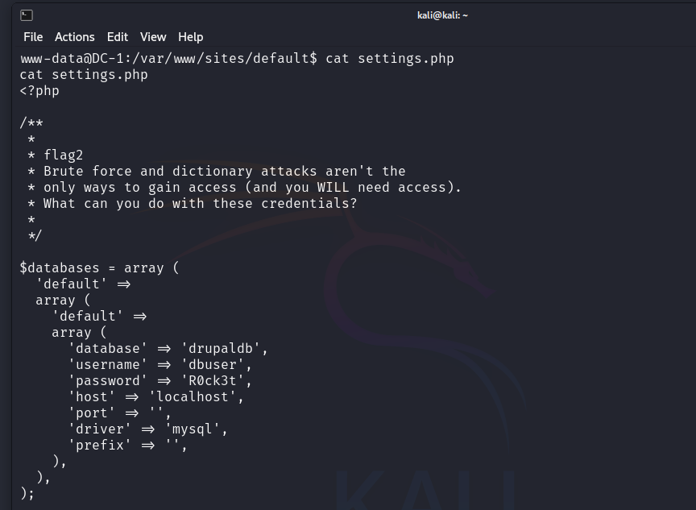

```text
/**
 *
 * flag2
 * Brute force and dictionary attacks aren't the
 * only ways to gain access (and you WILL need access).
 * What can you do with these credentials?
 *
 */


$databases = array (
  'default' => 
  array (
    'default' => 
    array (
      'database' => 'drupaldb',
      'username' => 'dbuser',
      'password' => 'R0ck3t',
      'host' => 'localhost',
      'port' => '',
      'driver' => 'mysql',
      'prefix' => '',
    ),
  ),
);
```

He obtenido unas credenciales para la base de datos.


Llamo a mysql pasandole por parametros el usuario. 

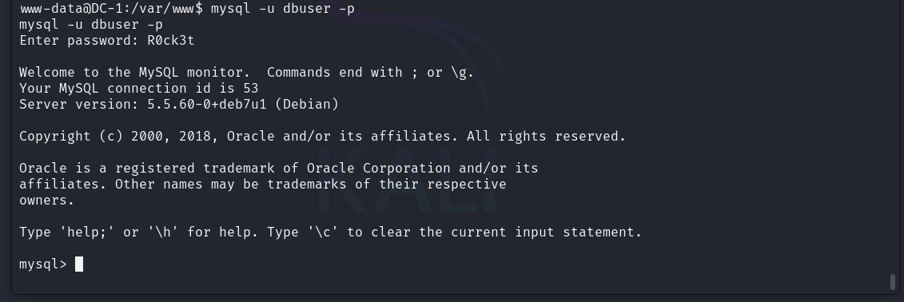

SHOW DATABASES;

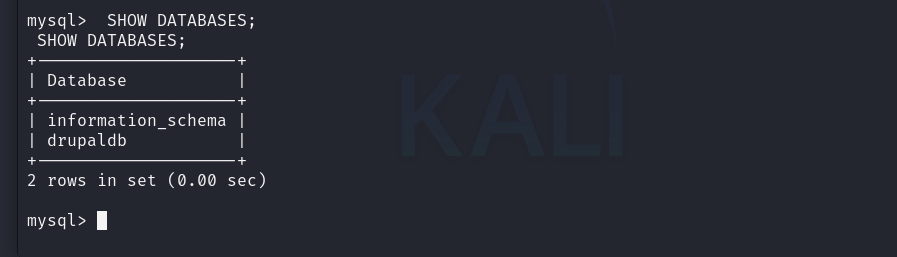

use drupaldb;


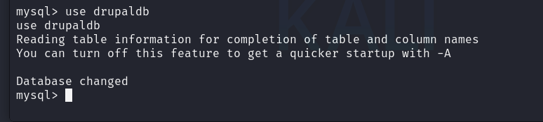

SHOW Tables;

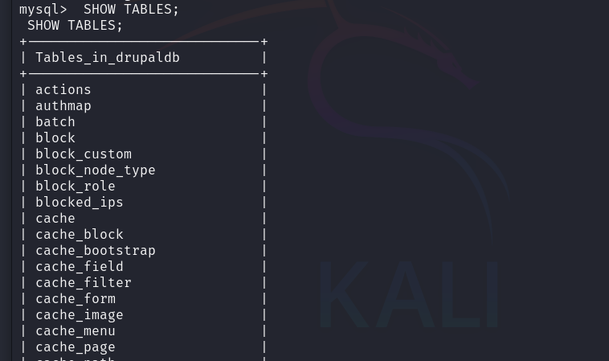

select * from users;

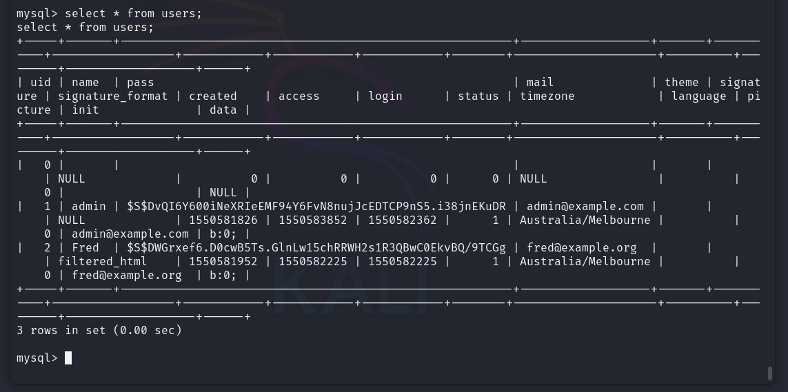

Obtengo las credenciales de admin y Fred, con sus correos admin@example.com y fred@admin.org respectivamente.

Ademas obtengo los hashes de las contraseñas para estos usuarios:

$S$DvQI6Y600iNeXRIeEMF94Y6FvN8nujJcEDTCP9nS5.i38jnEKuDR
$S$DWGrxef6.D0cwB5Ts.GlnLw15chRRWH2s1R3QBwC0EkvBQ/9TCGg


#### Exploracion puerto 111

### Explotación

#### Explotacion puerto XXXX

### Elevacion de privilegios
