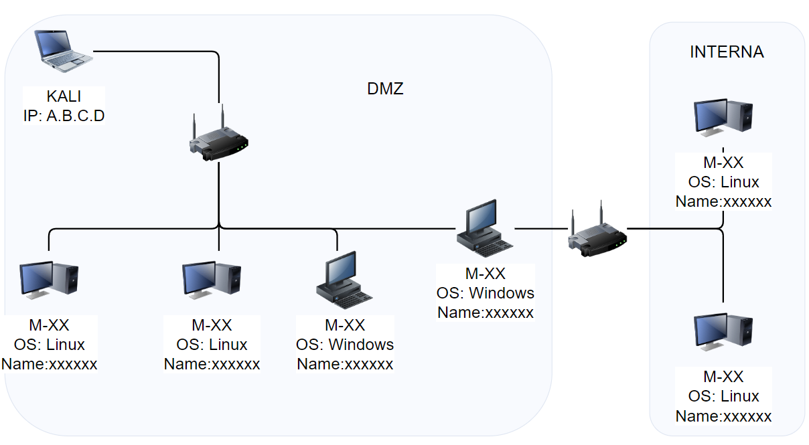

Hace poco decidí presentarme al examen de eJPTv2, y os quiero compartir mi experiencia con el proceso, desde la preparación hasta la obtención de la certificacion de eJPTv2, un examen de certificación ofrecido por eLearnSecurity. 

Esta certificación está orientada a profesionales de la ciberseguridad que están comenzando su carrera en pruebas de penetración (pentesting).

## Preparación para el examen

Mi camino hacia el examen de eJPTv2 comenzó con el estudio de la teoría y la práctica ofrecida por INE.

Ya habia trabajado en algunos proyectos relacionados con pentesting, pero sabía que necesitaba una base sólida de conocimientos técnicos para tener éxito en el examen. 

Aquí están algunos de los pasos clave que seguí durante mi preparación:

1. **Revisión de los temas del examen:**
   Lo primero que hice fue leer cuidadosamente el temario oficial del examen. eJPTv2 cubre una amplia gama de temas, desde la recopilación de información hasta la explotación de vulnerabilidades y la post-explotación. 
   
   Los temas principales incluyen:
   - Reconocimiento y enumeración de servicios
   - Vulnerabilidades comunes y ataques a aplicaciones
   - Herramientas de pentesting como Nmap, Gobuster, Nikto y Hydra
   - Técnicas de post-explotación y escalada de privilegios

2. **Cursos y materiales recomendados:**
   Decidí invertir tiempo (y dinero) en los cursos de eLearnSecurity, específicamente en el curso de eJPTv2. Este curso tiene muchas horas de video y mucha cantidad de informacion que comprender y sobre todo practicar en sus laboratorios. Ademas estudie modulos en la Academia de HackTheBox, en concreto el path de pentesting completo. Añadiendole el modulo de Wordpress que no recuerdo si esta dentro.

3. **Práctica en entornos controlados:**
   Además del curso, me hice maquinas de VulnHub (las podeis ver resueltas en este blog). EN ellas pude aplicar lo aprendido en un entorno controlado y con escenarios que simulaban vulnerabilidades reales. Practiqué con máquinas de diferentes niveles de dificultad para mejorar mi capacidad de identificación de vulnerabilidades y explotación.

## El día del examen

El examen de eJPTv2 es un desafío práctico en el que se requiere realizar una serie de tareas dentro de un entorno realista pero simulado, para demostrar las habilidades para realizar un pentesting.

Durante el examen, se te asignará una serie de objetivos que debes cumplir, lo que incluye obtener acceso a un sistema, identificar vulnerabilidades, explotar servicios, y realizar post-explotación e incluso pivoting a red interna.

1. **Inicio del examen:**
   Al comenzar, me sentí algo nervioso, pero una vez empecé a trabajar en el entorno del examen, me di cuenta de que estaba bien preparado. Lo primero que hice fue realizar un reconocimiento exhaustivo de la red y servicios disponibles. Utilicé herramientas como **Nmap** para obtener una visión general de la infraestructura y detectar los puertos abiertos.

2. **Enumeración de servicios:**
   Después de completar el escaneo de red, utilicé herramientas adicionales como Gobuster para enumerar directorios y **Nikto** para realizar una evaluación superficial de los servicios web. La clave fue no apresurarse; sabía que tomarme el tiempo para realizar una enumeración exhaustiva de los servicios aumentaría mis probabilidades de encontrar vulnerabilidades.

3. **Explotación de vulnerabilidades:**
   Una vez que identifiqué algunos servicios con vulnerabilidades conocidas, me concentré en explotarlas de manera controlada. Usé herramientas como **Hydra** para realizar ataques de fuerza bruta en los servicios con autenticación y **Metasploit** para explotar vulnerabilidades específicas. Tambien use mucho **JohnTheRipper** para romper hashes de claves.

4. **Post-explotación:**
   Al obtener acceso a cada uno de los sistemas, pasé a realizar la post-explotación, que incluía la recopilación de información sobre el sistema, la escalada de privilegios, etc. No hice persistencia ya que si reinicio el lab no se mantendria y seria perder el tiempo. 

## Consejos durante el examen

- **Uso eficiente del tiempo:**
  - El examen tiene un límite de tiempo (48 horas), por lo que es vital gestionar bien tu tiempo. **Toma descansos** al menos cada 4 horas, para comer algo, estirar las piernas, etc.
  - **Leete todas las preguntas antes de comenzar a contestar**. En estas preguntas te puedes encontrar que te dan usuarios para algunas maquinas, o te proponen claves posibles. Apuntalas y usalas.
  - No te quedes demasiado tiempo atascado en una tarea, si algo no funciona, pasa a otro objetivo y regresa a ello más tarde si es necesario.
  - **Aprovecha los momentos de descanso para lanzar ataques largos** contra servicios. Por ejemplo si vas a parar 1 hora para estirar las piernas, comer y descansar un poco, lanza un ataque de diccionario a algun servicio como ssh o ftp con diccionarios grandes que sepas que van a tardar un rato en completarse.
  - No hace falta llegar a ser root de todas las maquinas pero tampoco es complicado conseguirlo, son maquinas sencillas.
  
- **Piensa que no es un CTF** 
  - **No es un CTF**, no vas buscando pensar "out-the-box". Es un entorno realista, piensa que puede ser una empresa. No vayas a lo rebuscado o a un ataque muy elaborado.
  - Hazte un **listado de usuarios y claves** que vayas recopilando entre maquinas para probarlas en las siguientes maquinas. Incluso prueba a que las claves sean tan debiles que uses como diccionario de claves los nombres de los usuarios. 
  - Monta una carpeta en tu maquina atacante y la sirves en la red con un servidor web. Será tu "carpeta compartida" con los usuarios, las claves, y lo que te haga falta. 
  
- **Comprueba los resultados**
  - Si te preguntan por la clave de acceso de un usuario y la sacas rompiendo un hash, comprueba que puedes acceder con ese usuario y clave. 

- **Documentación:**
  
  Asegúrate de tomar notas detalladas de cada paso que realices. Yo hacia captura de pantalla y copia de comando ejecutado y resultado obtenido. La documentación es crucial para asegurarte de que no te pierdas detalles importantes durante el examen.

  - **Usa alguna herramienta para dibujar la red.** 
    - Yo use **draw.io** y fui colocando los diferentes elementos para obtener una visualizacion de la red con informacion que fui añadiendo durante el examen

    

  - **Usa una aplicacion para toma de notas.** 
    - Yo use **Visual Studio** con ficheros en markdown y usando algunos pluggins para dar formato al codigo que copiaba y pegaba. Tambien puedes usar **Obsidian** o **Notion**, etc. Da igual cual uses pero que te sientas muy comodo usandola.
    - Para cada maquina descubierta en la red fui creando un fichero para tomar notas de esa maquina. Y ademas tenia un fichero general para notas sobre la red, el entorno o informacion general que afectara a todas las maquinas.

## Resultados y lecciones aprendidas

Las lecciones más importantes son:

- La importancia de una buena enumeración y recopilación de información.
- El valor de tener una sólida comprensión de las herramientas de pentesting y saber cuándo usarlas.
- La necesidad de ser paciente y meticuloso durante el proceso de explotación.

En conclusión, el examen de eJPTv2 fue una experiencia desafiante pero gratificante. Me permitió poner en práctica mis habilidades de pentesting en un entorno realista aplicando mis conocimientos y habilidades. 
 
Para aquellos interesados en comenzar una carrera en pentesting, recomiendo encarecidamente este examen como un primer paso.