En este post, desglosaré cómo resolví el reto Nº 2 del CTF de JNIC 2024. Explicaré paso a paso el proceso que me llevó a encontrar la solución. Este desafío me permitió aplicar herramientas y técnicas de hacking ético en un escenario controlado, y compartiré las lecciones aprendidas que pueden ser útiles tanto para principiantes como para aquellos que busquen mejorar sus habilidades en CTF.

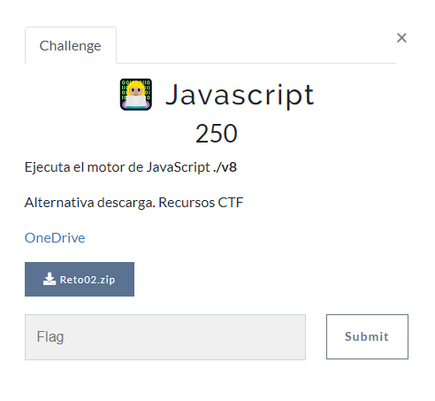

Descargo los ficheros que nos dan: Reto02.zip y los descomprimo en mi carpeta de trabajo para este reto.

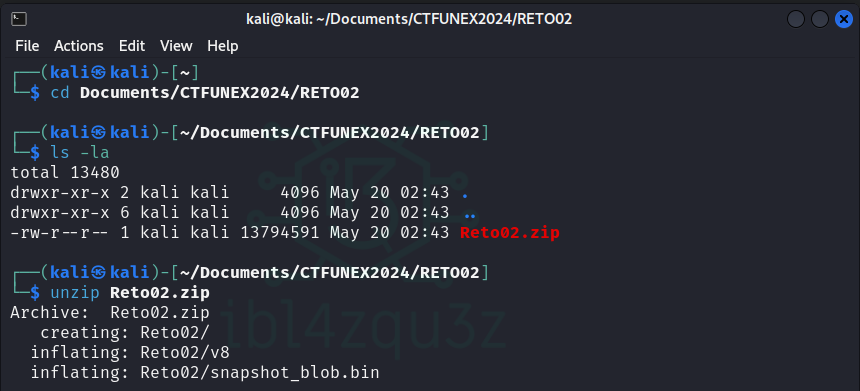

Obtengo los siguientes ficheros.

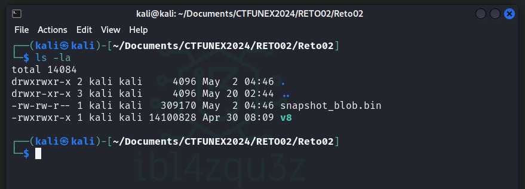

Según me indica el reto tengo que ejecutar el motor V8.

Con los permisos actuales puedo realizarlo, por lo que ejecuto V8.

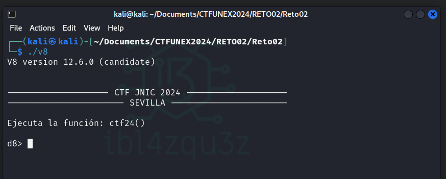

Nos pide que ejecutemos la funcion `ctf24()`

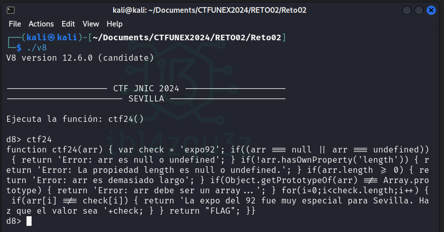

Al ejecutar nos ha dado todo el codigo de la funcion:

```javascript
function ctf24(arr) 
{ 
    var check = 'expo92'; 
    if((arr === null || arr === undefined)) {
        return 'Error: arr es null o undefined'; 
    } 
    if(!arr.hasOwnProperty('length')) {
        return 'Error: La propiedad length es null o undefined.'; 
        } 
    if(arr.length >= 0) { 
        return 'Error: arr es demasiado largo'; 
        } 
    if(Object.getPrototypeOf(arr) !== Array.prototype) { 
        return 'Error: arr debe ser un array...'; 
        } 
    for(i=0;i<check.length;i++) {
        if(arr[i] !== check[i]) {
            return 'La expo del 92 fue muy especial para Sevilla. Haz que el valor sea '+check; 
            } 
        } 
    return "FLAG"; }
}
```

El codigo hace lo siguiente:

1. la funcion ctf24 necesita un array de entrada.
2. Se define la variable check = 'expo92'
3. Se comprueban las siguientes propiedades del array y si alguna es cierta da error:
   1. Se comprueba que el array no es nulo o no esta definido
   2. Se comprueba que tiene longitud
   3. Se comprueba que la longitud es mayor o igual que 0.
   4. Se comprueba que es un array
   5. Se comprueba que el valor del array tiene que ser expo92
4. Si pasa las comprobaciones anteriores se da el valor de la flag.

Comprobando estas propiedades vemos que tenemos que definir un array con valores expo92 pero que el array tenga una longitud menor que 0.

Para definir el array realizamos el siguiente codigo:

```javascript
let arr = ['e', 'x', 'p', 'o', '9', '2'];
```

Compruebo que se queda almacenado:

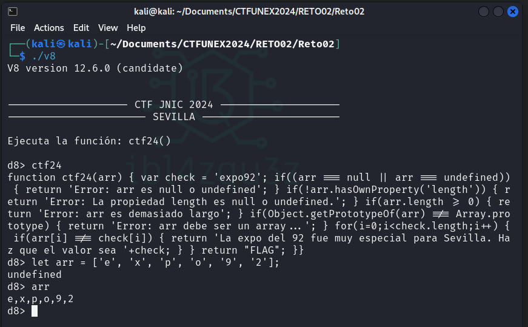

Ahora tenemos que adaptar las propiedades del array para que cumpla los requerimientos del programa ctf24.

Para ello le pasamos el siguiente codigo:

```javascript
let specialArray = new Proxy(arr, { get(target, prop) { if (prop === 'length') { return -1; } return target[prop]; }});
```

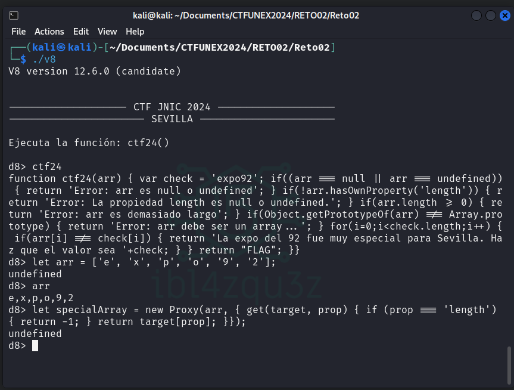

Ejecuto ahora la funcion pasando como parametros el array especial.

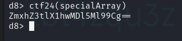

Nos devuelve un codigo que por su estructura perece estar codificado en base64 

```bash
ZmxhZ3tlX1hwMDl5Ml99Cg==
```

Decodifico el texto de base64 con el comando:

```bash
echo -n "ZmxhZ3tlX1hwMDl5Ml99Cg==" | base64 -d
```

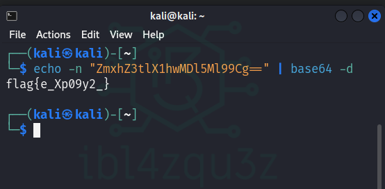

y obtengo la flag

```bash
flag{e_Xp09y2_}
```

La introduzco 

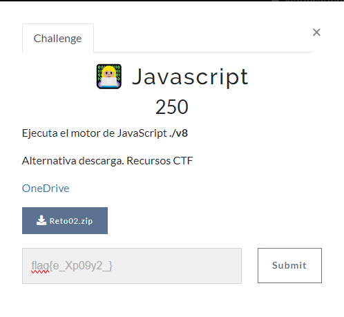

Y compruebo que la da por valida.

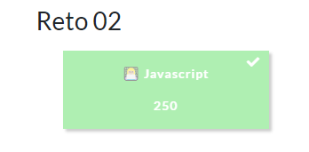
