En este post te enseño a instalar Metasploitable 3 en tu equipo para que puedas practicar pentesting en dos maquinas cargadas de vulnerabilidades. 

## Requisitos previos

- VirtualBox previamente instalado.
- Conexion a internet.

## Pasos:

### Paso 1: Instalar Vagrant 
   
   Descarga Vagrant desde la direccion web: 
   
   https://developer.hashicorp.com/vagrant/install

   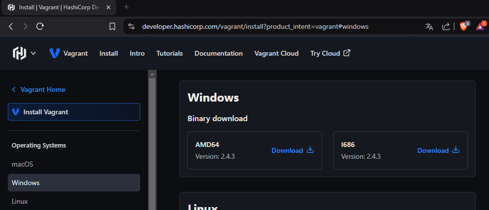

   Ejecuta el instalador descargado, acepta la licencia de uso y espera que acabe la instalacion.

   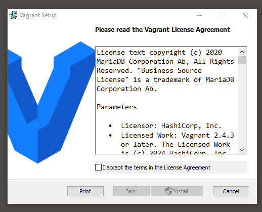
   
   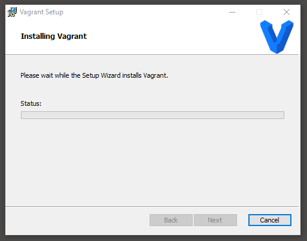
   
   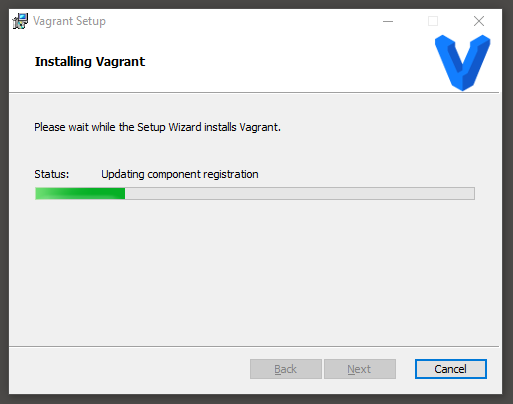

   **Importante**

   Reinicia tu sistema después de la instalación para que las variables de entorno se configuren correctamente.

   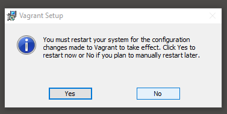

   Una vez reiniciado el sistema instala el plugin “Vagrant Reload” ejecutando el siguiente comando en la consola de comandos:
   
   ```
   vagrant plugin install vagrant-reload
   ```

   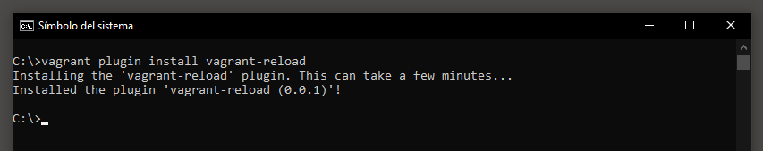

### Paso 2: Descargar las maquinas con vagrant.

Abre una consola de powershell y ejecuta los siguientes comandos:

```ps
cd \
mkdir metasploitable-workspace
cd metasploitable-workspace
```

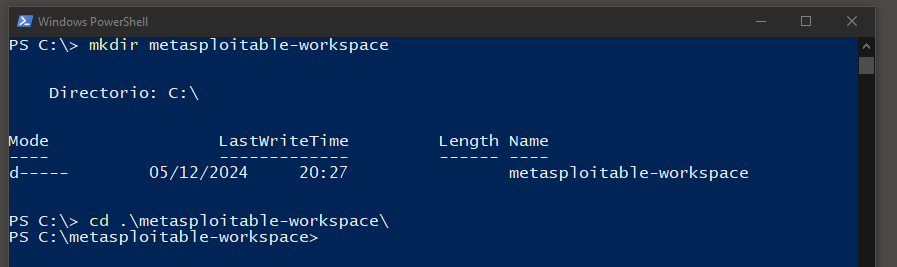

```ps
Invoke-WebRequest -Uri "https://raw.githubusercontent.com/rapid7/metasploitable3/master/Vagrantfile" -OutFile "Vagrantfile"
```

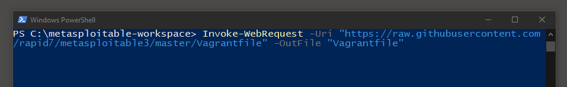

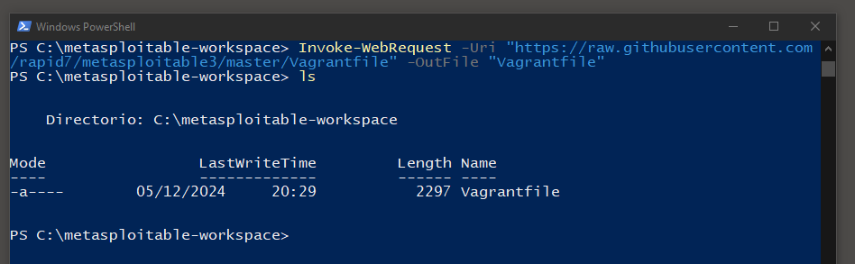

```ps
vagrant up
```

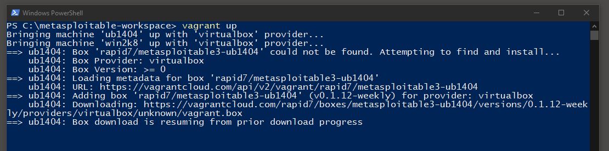

Este proceso se tomara un tiempo en acabar dependiendo de tu conexion a internet.

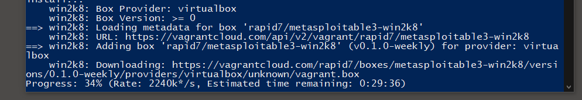

Cuando acabe el proceso tendremos 2 maquinas nuevas en VirtualBox.

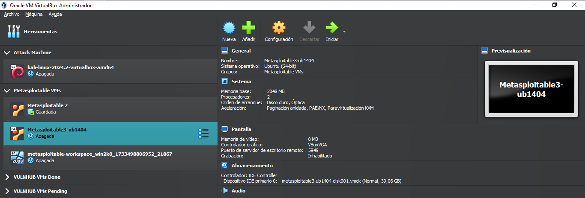

## ¡Enhorabuena!

Ahora ya tienes 2 maquinas nuevas llenas de vulnerabilidades para explotarlas.


