En este post, te guiaré a través del módulo **JavaScript Deobfuscation** de la plataforma **Hack The Box Academy**, resolviendo paso a paso todas las preguntas planteadas en el módulo y completando el Skill Assessment final.

Este módulo es esencial para cualquier persona interesada en seguridad web, ya que muestra como **ofuscar** y **desofuscar** el codigo **javascript**, algo que es clave en el pentesting de aplicaciones web. 

A lo largo del walkthrough, veras cómo **ofuscar** y **desofuscar** el codigo **javascript** para realizar pruebas de seguridad.

¡Vamos a ello! 🚀

## Codigo fuente

**Repite lo que aprendiste en esta sección y deberías encontrar una bandera secreta, ¿qué es?**

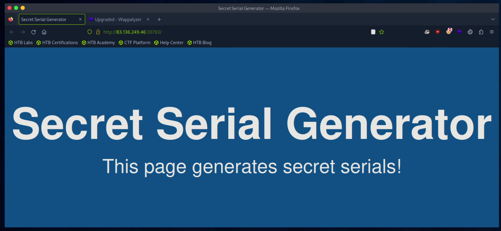

curl http://83.136.249.46:39783/

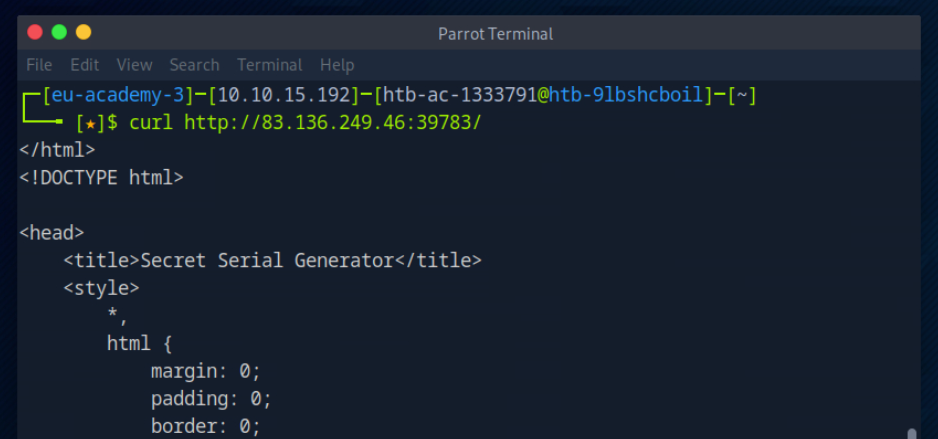

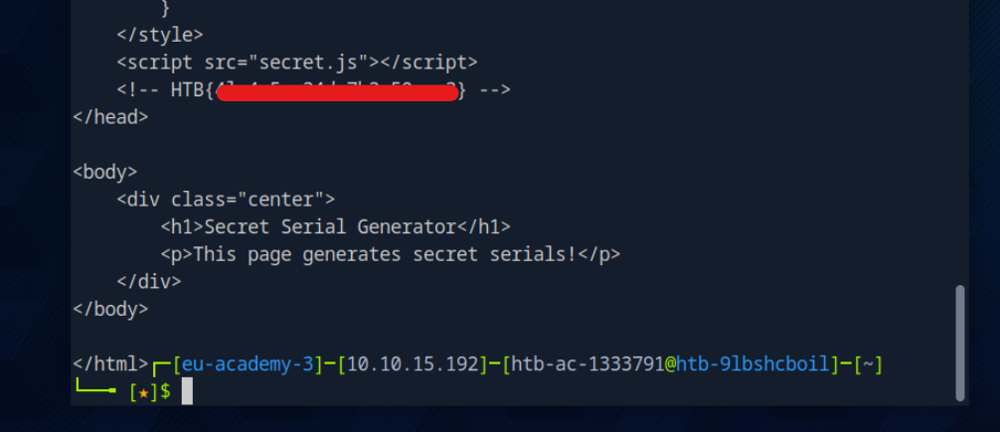

## Desofuscacion

**Con lo que aprendiste en esta sección, intenta desofuscar 'secret.js' para obtener el contenido de la bandera. ¿Qué es la bandera?**

we can open the browser debugger with **`CTRL+SHIFT+I`** and then click on our script secret.js. 

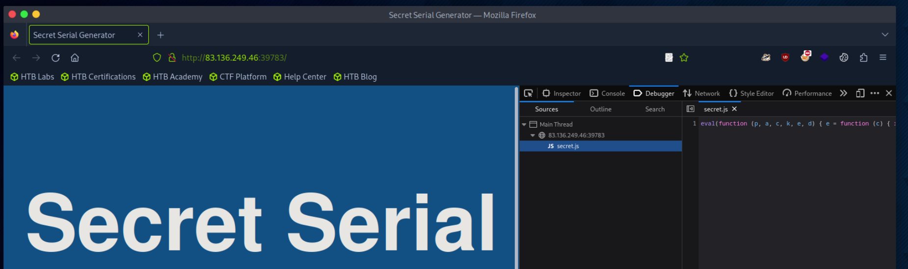

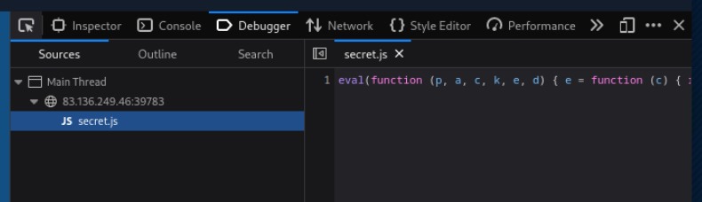

He obtenido el script siguiente:

```js
eval(function (p, a, c, k, e, d) { e = function (c) { return c.toString(36) }; if (!''.replace(/^/, String)) { while (c--) { d[c.toString(a)] = k[c] || c.toString(a) } k = [function (e) { return d[e] }]; e = function () { return '\\w+' }; c = 1 }; while (c--) { if (k[c]) { p = p.replace(new RegExp('\\b' + e(c) + '\\b', 'g'), k[c]) } } return p }('g 4(){0 5="6{7!}";0 1=8 a();0 2="/9.c";1.d("e",2,f);1.b(3)}', 17, 17, 'var|xhr|url|null|generateSerial|flag|HTB|1_4m_7h3_53r14l_g3n3r470r|new|serial|XMLHttpRequest|send|php|open|POST|true|function'.split('|'), 0, {}))
```

Go to [UnPacker](https://matthewfl.com/unPacker.html) and Copy and paste the script code secret.js

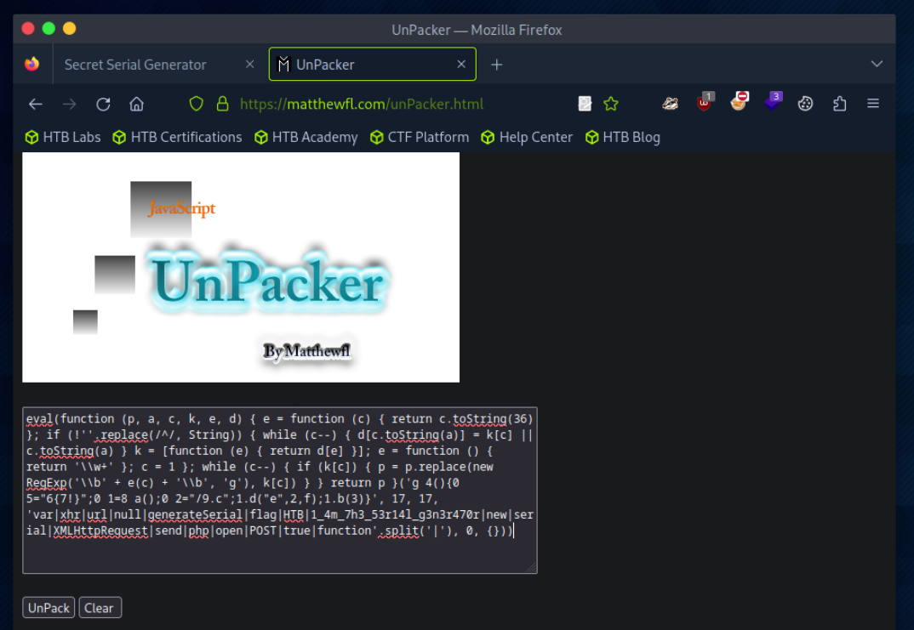

Press UnPack button

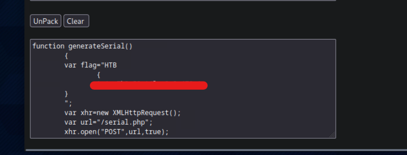

## Ejemplos de Deosofuscacion

### Peticiones HTTP

**Intenta aplicar lo que aprendiste en esta sección enviando una solicitud 'POST' a '/serial.php'. ¿Cuál es la respuesta que obtienes?**

To send a POST request, we should add the -X POST flag to our command, and it should send a POST request:

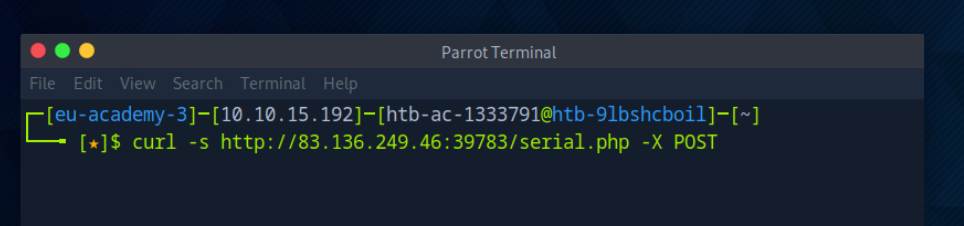

add the "-s" flag to reduce cluttering the response with unnecessary data

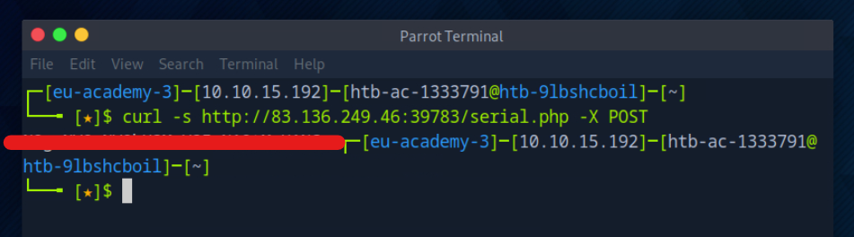

### Decodificacion

**Utilizando lo que aprendiste en esta sección, determina el tipo de codificación que se usó en la cadena que obtuviste en el ejercicio anterior y descodifícala. Para obtener la bandera, puedes enviar una solicitud 'POST' a 'serial.php' y configurar los datos como "serial=YOUR\_DECODED\_OUTPUT".**

He almacenado el valor de respuesta de la pregunta anterior en la variable $str para no desvelar la respuesta de la pregunta anterior.

Decodifico con:

```sh
echo $str | base64 -d
```

Almaceno la decodificacion en $str_decode y procedo a enviar la solicitud post para obtener la flag

```sh
curl http://83.136.249.46:39783/serial.php -X POST -d "serial=$str_decode"
```

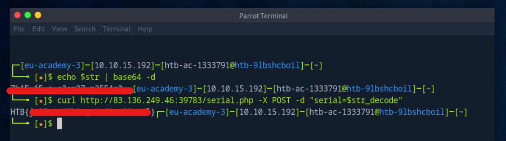


## Skills Assessment


**Try to study the HTML code of the webpage, and identify used JavaScript code within it. What is the name of the JavaScript file being used?**

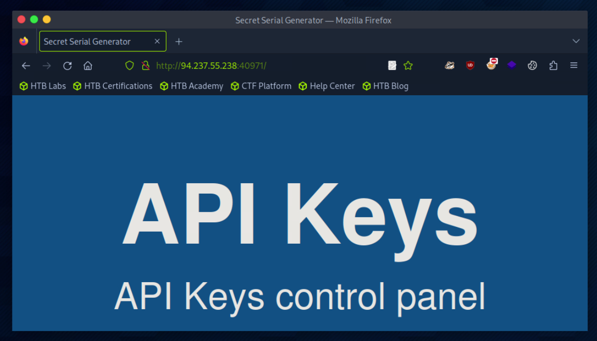

Ejecuto el comando para ver el codigo fuente de la pagina web alojada en el objetivo

curl http://94.237.55.238:40971

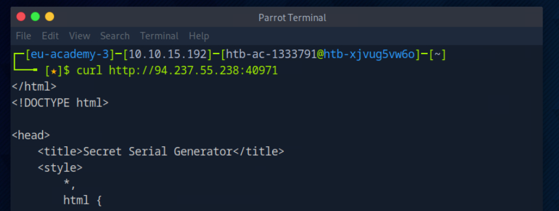

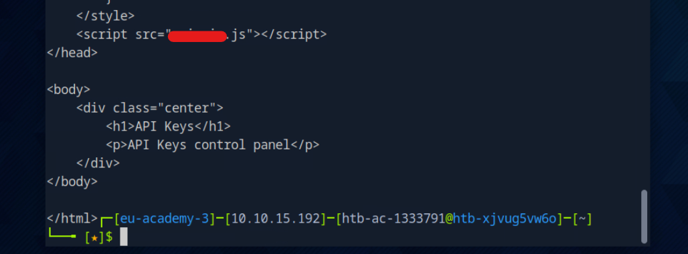


**Once you find the JavaScript code, try to run it to see if it does any interesting functions. Did you get something in return?**

Accedo a la herramienta de desarrolladores web.

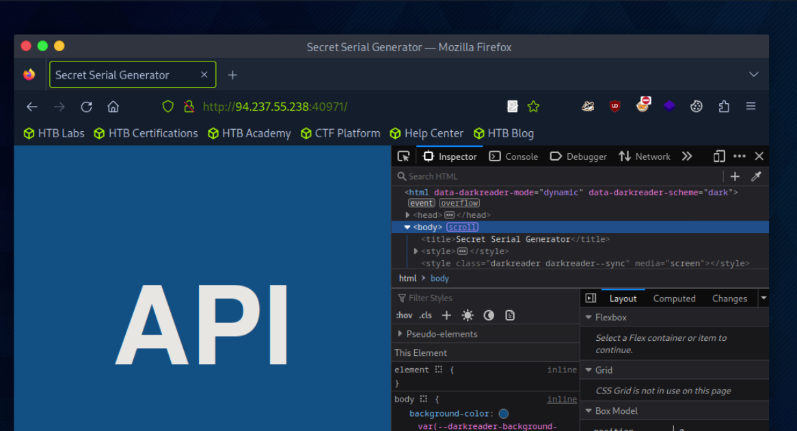

En la pestaña Debugger aparece el script JS. 

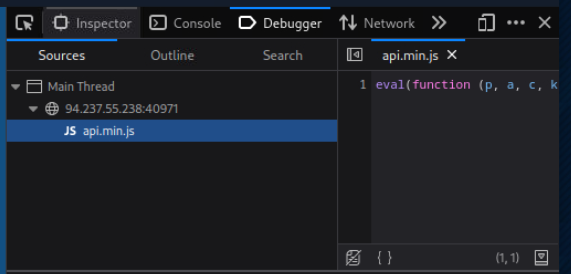

Compruebo la consola de la herramienta de desarrolladores y veo que se muestra la flag.

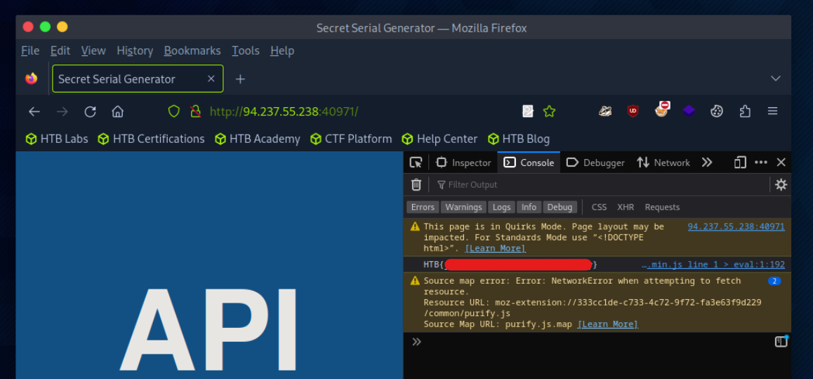

**As you may have noticed, the JavaScript code is obfuscated. Try applying the skills you learned in this module to deobfuscate the code, and retrieve the 'flag' variable.**

Con la herramienta curl puedo obtener el codigo JavaScript completo aunque ofuscado. 

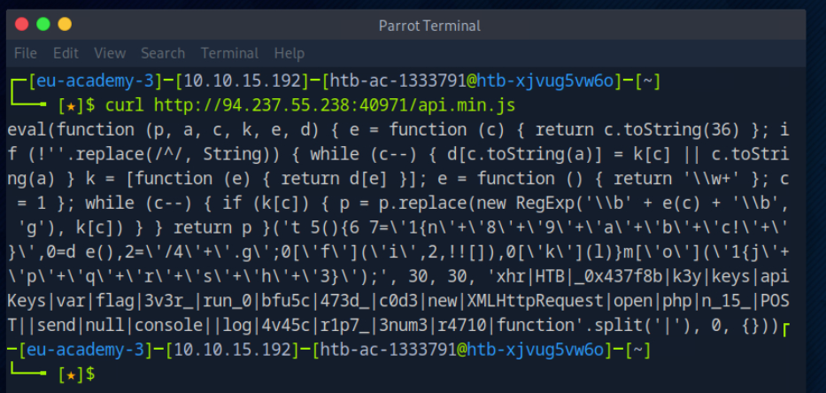

Lo copio y me dirijo a la web [UnPacker](https://matthewfl.com/unPacker.html) 

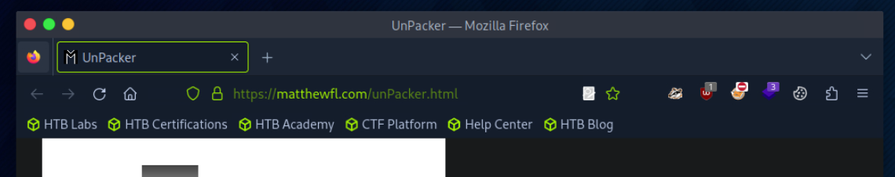

Pego el codigo y lo Desempaqueto.

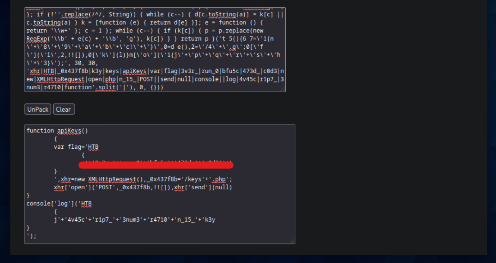

Veo que en el codigo se define una variable flag 

**Try to Analyze the deobfuscated JavaScript code, and understand its main functionality. Once you do, try to replicate what it's doing to get a secret key. What is the key?**

```js
function apiKeys()
	{
	var flag='HTB
		{
		... SNIP ...
	}
	',xhr=new XMLHttpRequest(),_0x437f8b='/keys'+'.php';
	xhr['open']('POST',_0x437f8b,!![]),xhr['send'](null)
}
```

Este script define tres variables: flag, xhr y _0x437f8b.

La variable xhr crea una instancia XMLHttpRequest con la URL /keys.php

A continuacion se realiza una peticion mediante POST a la pagina keys.php enviando "null".

Voy a replicar ese envio con curl.

```sh
curl http://94.237.55.238:40971/keys.php -X POST -d "null"
```

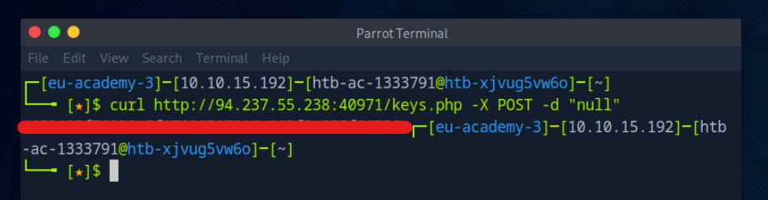

**Once you have the secret key, try to decide it's encoding method, and decode it. Then send a 'POST' request to the same previous page with the decoded key as "key=DECODED_KEY". What is the flag you got?**

Accedo a la web [cipher identifier](https://www.boxentriq.com/code-breaking/cipher-identifier) y compruebo el tipo de codificacion y nos indica que esta codificada esta en formato hexadecimal. Por lo que la paso a xxd para decodificarla.

Para no desvelar aqui la clave la he guardado en la variable $key_encoded

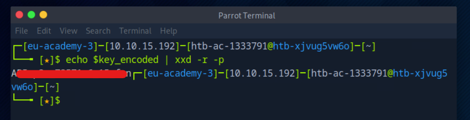

curl -s http://94.237.55.238:40971/keys.php -X POST -d "key=A...n"

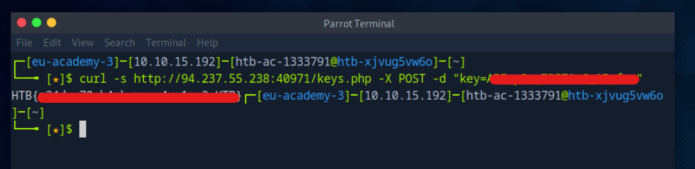


