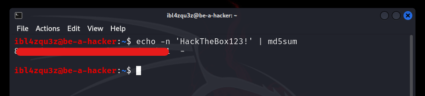
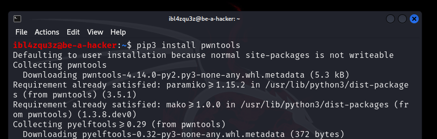
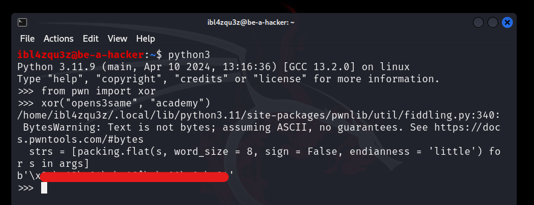
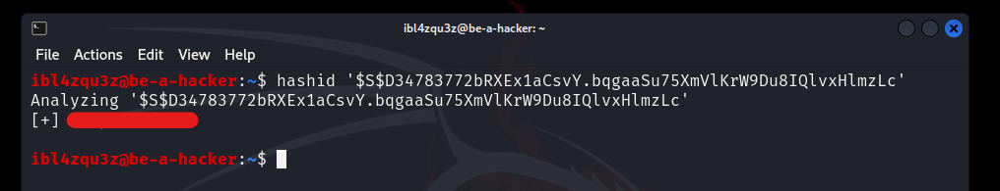
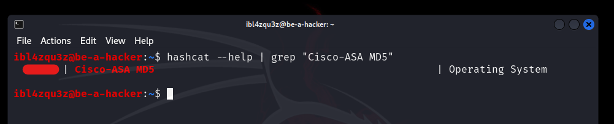
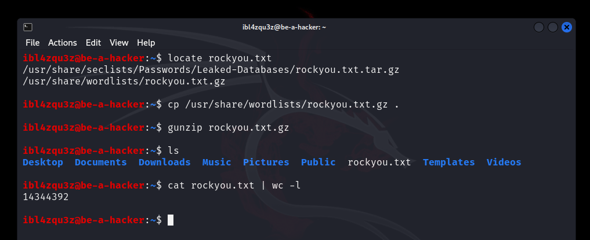
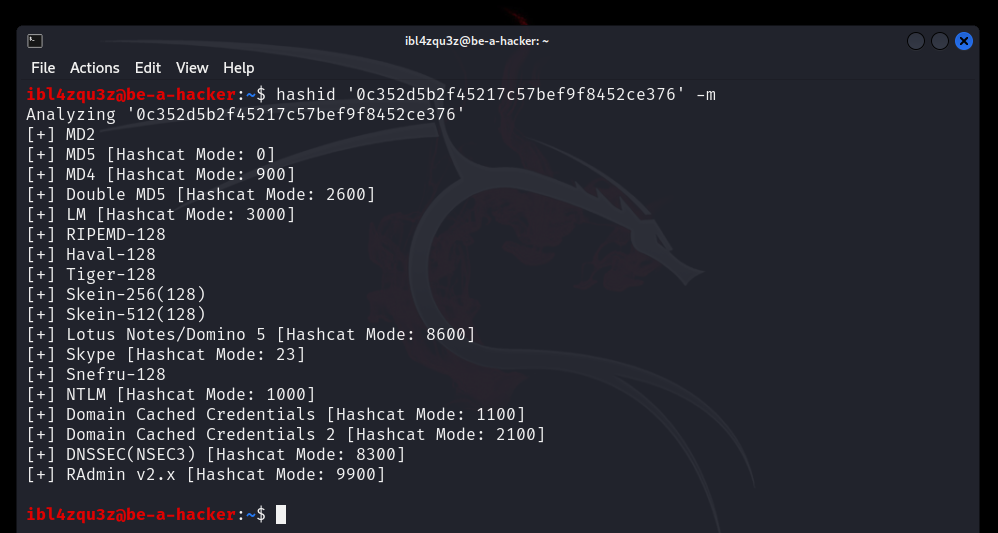
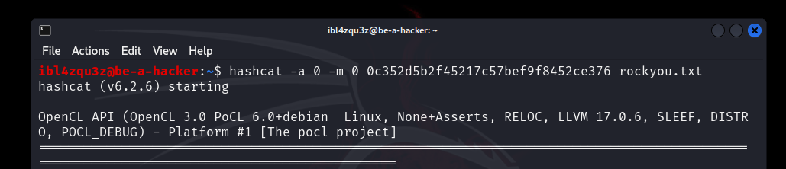
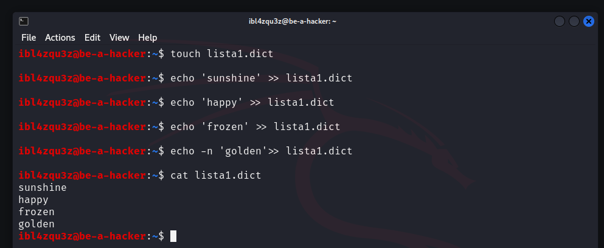

osTicket
 es un sistema de tickets de soporte de código abierto. En la práctica juega en la misma liga que Jira Service Management, OTRS, Request Tracker o Spiceworks: centraliza solicitudes de soporte que llegan por múltiples canales y las normaliza en un panel web.

A nivel técnico, osTicket está escrito en PHP y suele apoyarse en MySQL como backend. Puede desplegarse tanto en Linux como en Windows, lo que lo convierte en un candidato habitual en entornos mixtos (pymes, centros educativos, administraciones locales, etc.). Aunque no es trivial encontrar cifras públicas fiables sobre su cuota de mercado, basta con buscar Helpdesk software - powered by osTicket para ver miles de instancias expuestas, muchas asociadas a organizaciones reales. Incluso tuvo un cameo breve en Mr. Robot. ("Mr. Robot" S01E08, en el minuto 31)


El objetivo aquí no es solo aprender a enumerar y atacar osTicket, sino entender por qué los sistemas de ticketing merecen atención en una evaluación: suelen concentrar información sensible (PII, incidencias internas, adjuntos, credenciales compartidas “por urgencia”, correos reenviados) y además conectan con piezas críticas como correo, LDAP, bases de datos o integraciones externas. En una auditoría, ignorarlos suele ser un error.

Enumeracion

Para ilustrar el proceso usaré un entorno controlado en laboratorio, accesible en la IP X.X.201.88 y resolviendo el servicio mediante el hostname support.inlanefreight.local. A partir de aquí, todas las pruebas, evidencias y pasos de reproducción estarán referenciados a ese objetivo.

Para ello voy a añadir la entrada a /etc/hosts.

### Añadir la entrada (append)
```sh
echo "10.129.201.88 support.inlanefreight.local" | sudo tee -a /etc/hosts > /dev/null
```

### Verificación
```sh
tail -n 5 /etc/hosts
getent hosts support.inlanefreight.local
ping -c 1 support.inlanefreight.local
```


### Creacion de lista de objetivos

```sh
echo "support.inlanefreight.local" > scope_list
```


escaneo con nmap:

```sh
sudo nmap -p- --open -oA web_discovery -iL scope_list
```

.png>)

El analisis de los puertos con nmap me ha devuelto los siguientes puertos:

```
PORT     STATE SERVICE
22/tcp   open  ssh
80/tcp   open  http
8060/tcp open  aero
8081/tcp open  blackice-icecap
9094/tcp open  unknown
```

```sh
sudo nmap --open -sV -p22,80,8060,8081,9094 -iL scope_list

```
Un escaneo de versiones me da mas informacion sobre lo que hay en cada puerto

```
PORT     STATE SERVICE VERSION
22/tcp   open  ssh     OpenSSH 8.2p1 Ubuntu 4ubuntu0.3 (Ubuntu Linux; protocol 2.0)
80/tcp   open  http    Apache httpd 2.4.41 ((Ubuntu))
8060/tcp open  http    nginx 1.18.0
8081/tcp open  http    nginx
9094/tcp open  unknown
Service Info: OS: Linux; CPE: cpe:/o:linux:linux_kernel
```

Veo que hay un puerto http que compruebo mediante el navegador


Ahora con eyeWitness puedo tomar la salida XML de Nmap y crear un informe con capturas de pantalla de cada aplicación web presente en los distintos puertos mediante Selenium

Instalo EyeWitness con `sudo apt install eyewitness` 

Ejecuto la opcion `--web` predeterminada para tomar capturas de pantalla usando la salida XML de Nmap del escaneo de descubrimiento como entrada.

```sh
eyewitness --web -x web_discovery.xml -d inlanefreight_eyewitness
```

.png>)

Al abrir el informe obtengo la siguiente salida:



La informacion que me da es: 


```
http://support.inlanefreight.local
Resolved to: 10.129.201.88

Page Title: Inlanefreight Helpdesk
Date: Tue, 06 Jan 2026 01:08:23 GMT
Server: Apache/2.4.41 (Ubuntu)
Set-Cookie: OSTSESSID=ligr7c1lblm2n395s3ivfeftn0; expires=Wed, 07-Jan-2026 01:08:23 GMT; Max-Age=86400; path=/; domain=support.inlanefreight.local; HttpOnly
Expires: Thu, 19 Nov 1981 08:52:00 GMT
Cache-Control: no-store, no-cache, must-revalidate
Pragma: no-cache
Content-Security-Policy: frame-ancestors 'self';
Content-Language: en-US
Vary: Accept-Encoding
Content-Length: 4975
Connection: close
Content-Type: text/html; charset=UTF-8
Response Code: 200 
```

Puedo observar que hay una cookie de sesion: OSTSESSID con valor ligr7c1lblm2n395s3ivfeftn0

Un escaneo con Nmap, por sí solo, normalmente se quedará en la capa de servicio y no en la de aplicación: te dirá qué hay escuchando (por ejemplo Apache o IIS), versiones aproximadas, cabeceras, TLS y poco más. 

Eso es útil para orientar el contexto, pero no sirve para perfilar osTicket como aplicación: no te va a enumerar rutas, paneles, endpoints ni comportamientos internos relevantes. Para huellar la aplicación hay que pasar a enumeración web específica (rutas, contenidos, respuestas, patrones propios de osTicket, etc.).

osTicket es una aplicación web con un mantenimiento constante. Si miro el histórico de CVE a lo largo de los años, no encuentro un “catálogo” amplio de vulnerabilidades explotables de forma directa. Esto es lo que suele pasar en escenarios reales **no siempre hay un exploit público esperando a ser ejecutado**. La ventaja suele venir de entender **cómo funciona la aplicación** y **cómo fluye la información**.


Una forma útil de analizar osTicket es descomponerlo en tres capas funcionales:

1. Entrada de usuario (User input)

- Formularios del portal (crear ticket, responder, adjuntar archivos).
- Campos controlados por el usuario: asunto, cuerpo, email, adjuntos, metadatos.
- Superficies indirectas: cabeceras, parámetros, URLs, contenido HTML/Markdown, contenido de adjuntos.

2. Procesamiento (Processing)

- Normalización y validaciones (tipo/tamaño de adjuntos, filtrado, sanitización).
- Enrutado interno: creación de ticket, asignación a colas/departamentos, prioridades, estados.
- Automatizaciones e integraciones: correo entrante/saliente, reglas, plantillas, notificaciones, LDAP/AD, webhooks o plugins si existen.
- Persistencia: qué se guarda en base de datos y cómo se representa luego en la interfaz.

3. Resultado / salida (Solution)

- Renderizado en el portal y en el panel de staff (lo que ven usuarios y agentes).
- Notificaciones y correos generados a partir de la entrada (plantillas, HTML, enlaces).
- Adjuntos accesibles desde distintas vistas y permisos.
- Exposición de datos operativos: nombres, correos, estructura interna, tiempos, logs funcionales.


## Ataque a osTicket

Voy a interaccionar con la aplicacion para comprobar su comportamiento como haria un usuario, 

### Creacion de un ticket.










Como se ve en la imagen cuando acabo de crear el ticket me da id de ticket y un email 

ticket id: 478863
email: 478863@inlanefreight.local

Esto es algo habitual en los sistemas de helpdesk donde dan un correo para añadir mas informacion sobre un ticket.

Comprobacion de la informacion del ticket







